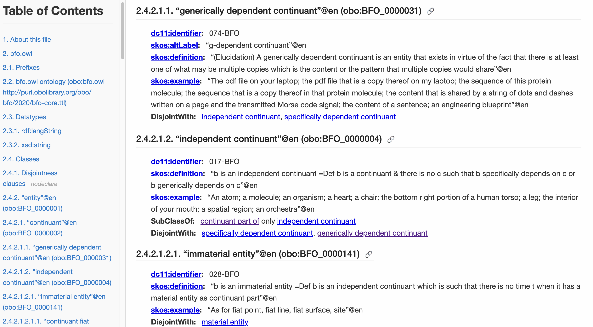

# What

This repository contains a template for writing OWL ontologies as
[Org Mode](https://orgmode.org/) documents, with supporting functions and scripts.
ELOT works on Windows, MacOS, and Linux.

[Literate programming](https://en.wikipedia.org/wiki/Literate_programming) is a paradigm where the creator of some technical artefact focuses on the explanation and readability of each technical construct, rather than its formal machine-readable definition.
The machine-readable artefacts are then extracted through a process called "tangling".

ELOT takes inspiration from this paradigm and uses the excellent Emacs
Orgmode plain-text format to create an author- and reader-friendly
ontology authoring environment. Ontological constructs are generated
from headlines and description lists. Export to OWL (OMN or Turtle)
and documentation (HTML or PDF).  Diagrams are generated from Turtle
blocks or SPARQL queries using the rdfpuml tool.

**NEW** April 2025: Minimalistic templating from tables &#x2013; handy when you
need to add many similar-looking classes and don't need complex
template expansion.

**NEW** March 2025:

-   Convert OWL files to ELOT's org-mode format.
    Download the `jar` binary from [releases](https://github.com/johanwk/elot/releases), store as `elot-exporter.jar` in your `bin/`
    and open existing OWL files with function `elot-open-owl`.
-   VS Code support: For instructions on how to run ELOT commands directly from within VS
    Code on your own projects, please see the detailed 
    [README](vscode-support/README.md).

-   [Prerequisites in brief](#orgf90c70d)
-   [Installation](#org0ae2a22)
    -   [Get Emacs](#org69256a4)
    -   [Install ELOT in Emacs](#org4ce8ade)
    -   [Install ELOT auxiliaries](#org3660729)
-   [Quick start using ELOT](#orgba667a5)
    -   [Adding an ontology](#org6199c76)
    -   [Adding classes and relations](#org8113df2)
    -   [Adding annotations](#org607dde4)
    -   [Querying the ontology](#orga4537d0)
    -   [Making a diagram](#org2f0555b)
    -   [Display labels instead of identifiers](#orgcc6fdf0)

## Prerequisites in brief

-   Download ELOT using [Git](https://github.com/git-guides/install-git) to easily obtain updates
-   Use a recent version (29+) of [Emacs](https://www.gnu.org/software/emacs/download.html)
-   For viewing your ontologies, install [Protégé Desktop](https://protege.stanford.edu/)
-   Install [Java](https://www.java.com/en/download/help/download_options.html) to enable advanced features
    -   Turtle output, ontology metrics, and more: install [ROBOT](http://robot.obolibrary.org/)
    -   Ontology diagrams: install [PlantUML](https://plantuml.com/) and [rdfpuml](https://github.com/VladimirAlexiev/rdf2rml)
    -   Open OWL files: Download `elot-exporter` from [releases](https://github.com/johanwk/elot/releases)

## Installation

### Get Emacs

See the [GNU Emacs download page](https://www.gnu.org/software/emacs/download.html).

For new Windows users: download Emacs from a [GNU mirror](http://ftpmirror.gnu.org/emacs/windows); the latest
version is in the `emacs-30` directory. The package named
[emacs-30.1-installer.exe](http://ftp.gnu.org/gnu/emacs/windows/emacs-30/emacs-30.1-installer.exe) will work fine (as of 2025-03-11). It's
preferable to install into a folder that doesn't contain spaces.

If you are new to Emacs, the book [Mastering Emacs](https://www.masteringemacs.org/) is highly
recommended.

### Install ELOT in Emacs

ELOT is in active development. For easy access to updates, you
should *clone* the ELOT repository using Git.

1.  Create a directory for local Emacs add-ons in your home folder,
    named `elisp` (on Windows, that will likely mean
    `c:\Users\mynamelisp\`).
2.  Clone ELOT into the `elisp` folder using your Git client.  If using
    a terminal for Git, the following will do it.
    
        cd elisp
        git clone https://github.com/johanwk/elot.git
    
    You should now have a subfolder of `elisp` called `elot`.
3.  Ensure ELOT is loaded when Emacs starts up.
    -   For new Emacs users: find the file `elot-init.el` inside the `elot`
        folder, and copy it to a new file named `.emacs` *in your home
        folder*, then restart Emacs. You should now be looking at a
        basic, working Emacs configuration.
    -   Experienced Emacs users should open `elot-init.el` and look at the
        list of packages that are required. Add
        `~/elisp/elot/elot-package/` to your `load-path`.

### Install ELOT auxiliaries

ELOT relies on external software programs to query your ontologies
and produce diagrams. These need to be downloaded.

Preparatory steps, if needed:

1.  Create a directory named `bin` in your home folder: you will
    download programs to this folder. On Windows, that will mean
    `c:\Users\mynamein\`; also ensure the environment variable
    `HOME` is set (check [issue 83](https://github.com/johanwk/elot/issues/83)).
2.  Ensure the `bin` folder is on your PATH, so the programs can be
    found by ELOT. On Windows, use the Control Panel to edit Local
    Environment Variables and add `c:\Users\mynamein\` to the list.

Get the tools:

1.  The [ROBOT](http://robot.obolibrary.org/) tool is highly recommended for ELOT. Download [robot.jar](https://github.com/ontodev/robot/releases/download/v1.9.5/robot.jar)
    from the [ROBOT releases](https://github.com/ontodev/robot/releases) page to your `bin` folder.
2.  The [PlantUML](https://plantuml.com/) tool is needed for diagrams.
    Download the latest version from [PlantUML Downloads](https://plantuml.com/download) (tested with [plantuml-1.2024.3.jar](https://github.com/plantuml/plantuml/releases/download/v1.2024.3/plantuml-1.2024.3.jar))
    to your `bin` folder.
    For convenience, rename it as just `plantuml.jar` (on Linux, make a symlink).
3.  The [rdfpuml](https://github.com/VladimirAlexiev/rdf2rml) tool will produce great-looking diagrams for
    ontologies.
    -   On Windows, download [rdfpuml.exe](https://github.com/VladimirAlexiev/rdf2rml/raw/master/bin/rdfpuml.exe) to your `bin` folder.
    -   On Linux or MacOS, clone the repository to your `bin` folder, then
        add `~/bin/rdf2rml/bin/` to your PATH. Install Perl modules as
        listed in the [rdfpuml installation guide](https://github.com/VladimirAlexiev/rdf2rml?tab=readme-ov-file#installation).
        
            cd ~/bin
            git clone https://github.com/VladimirAlexiev/rdf2rml.git
4.  The `elot-exporter`  tool converts existing OWL ontologies to ELOT's
    org-mode format. Once downloaded, you can open an OWL ontology
    from a local file, or from a URL, with `M-x elot-open-owl`.
    -   download the latest Java JAR from [releases](https://github.com/johanwk/elot/releases) and save it as
        `elot-exporter.jar` in your `bin` folder.

## Quick start using ELOT

### Adding an ontology

Open the familiar Pizza ontology from `elisp/elot/examples/pizza.org`
for an example of what an ELOT file will look like. Check the menu bar
to locate the ELOT menu.

To create a new ontology, do this in Emacs:

-   Select a directory that you want to work in. Open a new Org Mode
    file, for instance `myontology.org`.
-   Insert the ELOT template for a document header.
    From the bottom of the ELOT menu, select *Insert New Ontology Document Header*.
    Answer the prompts, and a header is produced, like the following.
    
        # -*- eval: (load-library "elot-defaults") -*-
        #+title: My new ontology
        #+subtitle: An OWL ontology
        #+author: John Doe
        #+date: WIP (version of 2024-04-04 12:34)
-   Insert the ELOT template for an ontology skeleton: menu entry
    *Insert New Ontology Skeleton*. Answer the prompts &#x2013; be
    ready to provide namespaces/prefixes for your ontology and the
    resources it will contain. You should see something like this
    screenshot:

Now create an OWL file from your new document.

-   Menu entry *Export to OWL* will "tangle" the ontology to a file
    in OWL Manchester Syntax, e.g., with filename
    `myontology.omn`.
-   If you have installed ROBOT, a Turtle file named `myontology.ttl`
    will also be generated.
-   Have Protégé ready, and open the ontology file to inspect it.

-   Export to an HTML document with menu entry *Export to HTML*. The document
    will open in your web browser.

### Adding classes and relations

-   Navigate to the `Classes` heading
-   Select *Insert Primitive/Defined Class template* from the menu to
    declare a class. Some appropriate annotation properties from the
    [Industrial
    Ontology Foundry Annotation Vocabulary (IOF-AV)](https://spec.industrialontologies.org/iof/ontology/core/meta/AnnotationVocabulary/) are included.
-   Navigate to the `Object properties` heading
-   Select *Insert Property template* for an object, data, or annotation
    property.
-   The screenshot shows how checkboxes are included for tracking
    progress. These are completely optional and won't appear in output.

### Adding annotations

ELOT makes it easy to add annotations to both annotations and axioms: 
just put them in a description list (~ - term :: value~).
In this screenshot, two annotations are added to the "transitive" characteristic axiom:

### Querying the ontology

-   Navigate to the `Prefixes` heading and insert a new heading named
    "Queries".
-   Select menu item *Insert SPARQL Select Block*, then write a query over
    the ontology.
-   Hit `C-c C-c` to run the query.

### Making a diagram

-   A SPARQL *construct* query will produce Turtle code for a
    diagram. Select *Insert SPARQL Construct Block*.
-   Write a query and hit `C-c C-c` to run it.

-   Select *Insert RDFPUML Diagram Block*.
-   When prompted, provide the name of the Turtle source (the name of
    the construct query) and a figure caption.
-   Place the cursor on the row of the  `#+call:` and hit `C-c C-c`. A
    diagram is generated.

-   Select *Export to HTML* to view your ontology in a browser.

### Display labels instead of identifiers

ELOT can display readable labels instead of prefixed identifiers
(which are unreadable if the identifiers are not informative), 
and offers quick search across the ontology resources. Hit F5 to toggle.

# Navigating Ontologies with Xref

ELOT supports cross-referencing and navigation using Emacs’s built-in
`xref` system. This allows users to find where a resource is used
and to jump directly to its definition from anywhere in an ELOT buffer.

To find all references to a CURIE (e.g., `:BFO_0000015`), place the cursor
on it and type `M-?` (`xref-find-references`). The `*xref*` buffer will open
and show each occurrence, along with the heading and flattened description
list entry for context.

Inside the `*xref*` buffer:

-   Press `RET` to jump to the occurrence.
-   Move the cursor to any other CURIE and press `M-.` (`xref-find-definitions`)
    to jump to its definition (typically the Org headline where it's declared).

Label overlays are enabled automatically in the `*xref*` buffer, so
identifiers appear with readable labels if available. This makes it easier
to explore large ontologies interactively.

This functionality is activated automatically for Org files exported with
ELOT startup code and does not require additional setup.

# HTML style

HTML output from ELOT produces stable anchors for ontology resources,
and shows readable labels with internal, clickable links.

