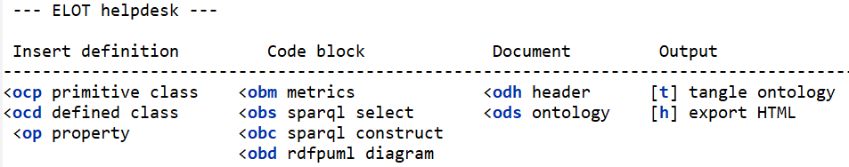
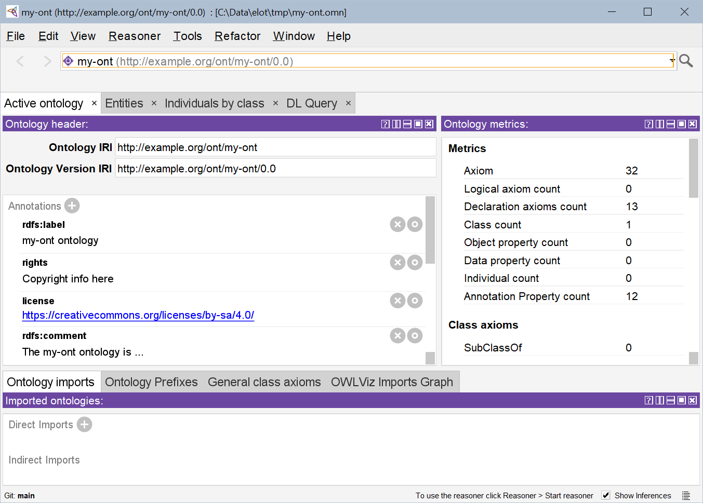
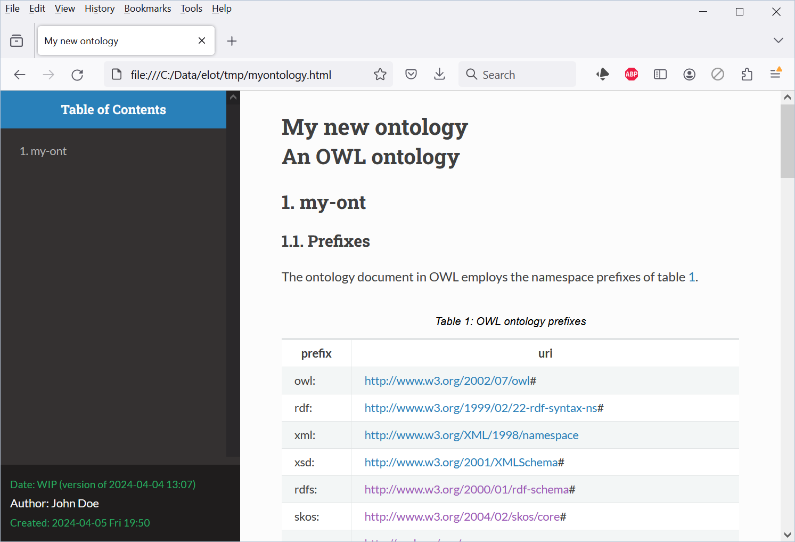
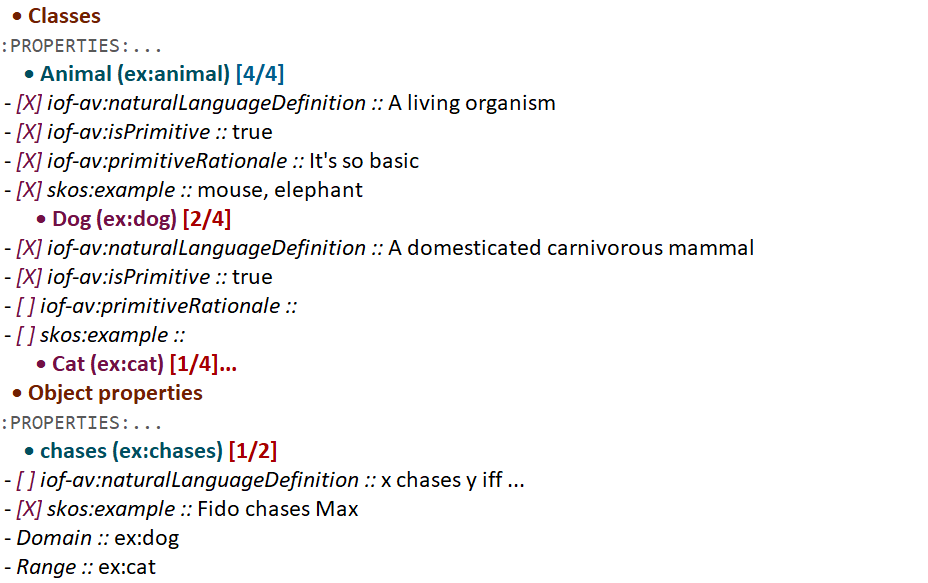
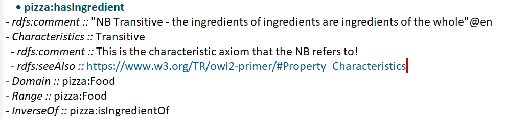
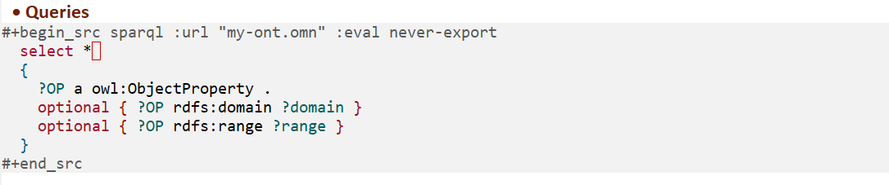
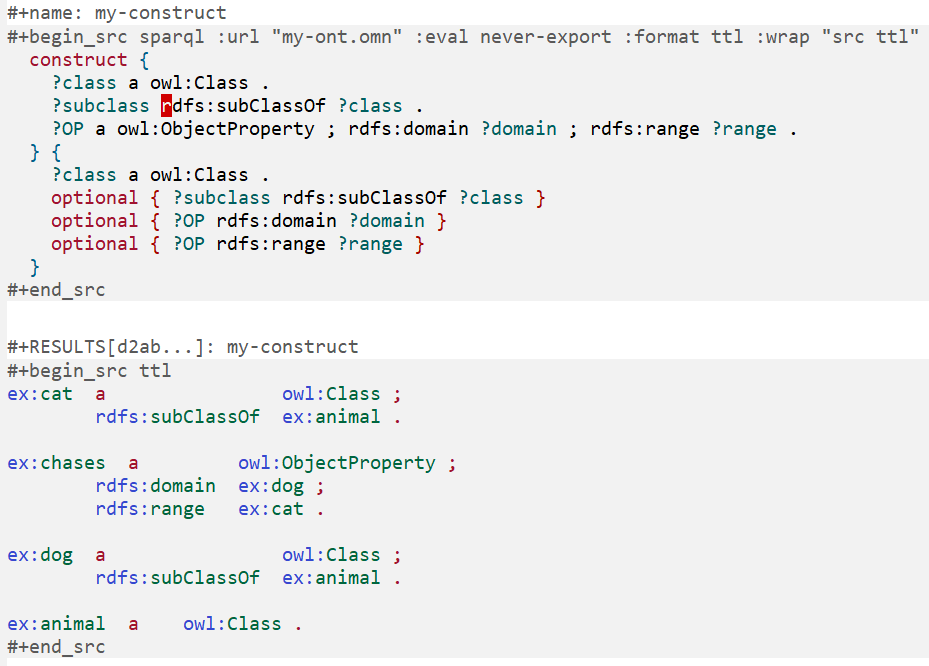
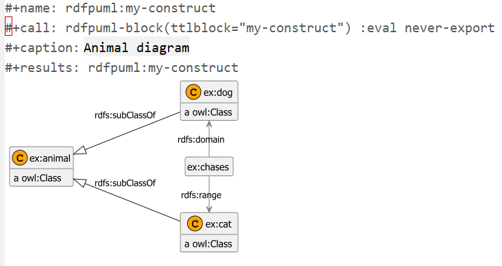
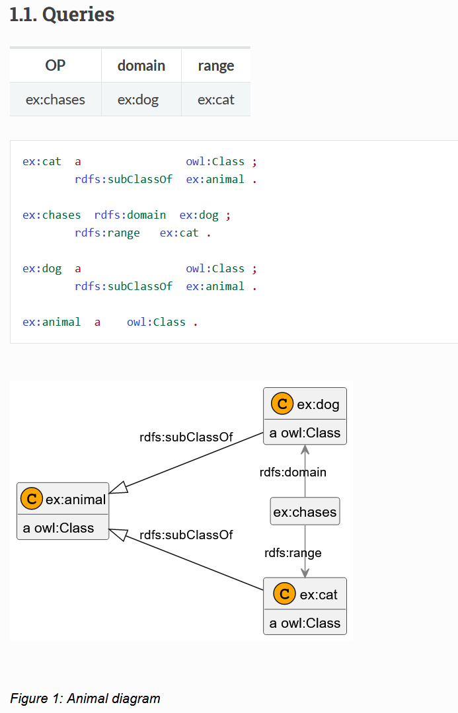
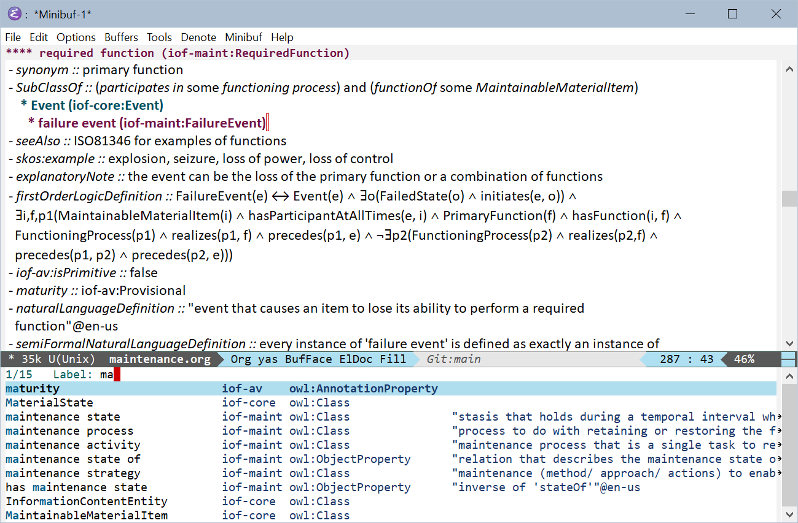

# What

This repository contains a template for writing OWL ontologies as
[Org Mode](https://orgmode.org/) documents, with supporting functions and scripts.

**NEW** March 2025: Convert OWL files to ELOT's org-mode format. Download
the `jar` binary from [releases](https://github.com/johanwk/elot/releases), store as `elot-exporter.jar` in your `bin/`
and open existing OWL files with function `elot-open-owl`.

Check out the files `pizza.org`, `bfo-core.org`, `maintenance.org` for
example ELOT files with queries and diagrams, or check out the files in [examples](https://github.com/johanwk/elot/tree/main/examples).

ELOT works on Windows, MacOS, and Linux (tested in WSL).

**Visual Studio Code Integration**:
For instructions on how to run ELOT commands directly from within VS
Code on your own projects, please see the detailed 
[README](vscode-support/README.md).

[Literate programming](https://en.wikipedia.org/wiki/Literate_programming) is a paradigm where the creator of some technical artefact focuses on the explanation and readability of each technical construct, rather than its formal machine-readable definition.
The machine-readable artefacts are then extracted through a process called "tangling".

ELOT takes inspiration from this paradigm and uses the excellent Emacs Orgmode plain-text format to create an author- and reader-friendly ontology authoring environment.
Ontological constructs are generated from narrative sections and Manchester Notation (OMN) fragments. Diagrams are generated from Turtle examples or SPARQL queries by using the rdfpuml tool.
The tool then extracts ontological definitions (OMN or Turtle) and documentation (HTML or PDF).

-   [Prerequisites in brief](#org9915c22)
-   [Installation](#org69ff0d4)
    -   [Get Emacs](#orgbd0df64)
    -   [Install ELOT in Emacs](#orgee24c5e)
    -   [Install ELOT auxiliaries](#orgb4eabf8)
    -   [NEW: Convert existing OWL files to ELOT format](#org8e35464)
-   [Quick start using ELOT](#orgb7fde59)
    -   [Adding an ontology](#org3c48964)
    -   [Adding classes and relations](#org46f38a0)
    -   [Adding annotations](#org804d19c)
    -   [Querying the ontology](#orgbebadc9)
    -   [Making a diagram](#orgd46ad0a)
    -   [Display labels instead of identifiers](#org429e2c9)
-   [Navigating Ontologies with Xref](#org7253f33)

## Prerequisites in brief

-   Download ELOT using [Git](https://github.com/git-guides/install-git) to easily obtain updates
-   Use a recent version (29.x) of [Emacs](https://www.gnu.org/software/emacs/download.html)
-   For viewing your ontologies, install version 5.6 of [Protégé Desktop](https://protege.stanford.edu/)
-   Install [Java](https://www.java.com/en/download/help/download_options.html) to enable advanced features
    -   Turtle output, ontology metrics, and more: install [ROBOT](http://robot.obolibrary.org/)
    -   Ontology diagrams: install [PlantUML](https://plantuml.com/) and [rdfpuml](https://github.com/VladimirAlexiev/rdf2rml)
    -   Open OWL files: Download `elot-exporter` from [releases](https://github.com/johanwk/elot/releases)

If you are new to Emacs, the book [Mastering Emacs](https://www.masteringemacs.org/) is highly
recommended.

## Installation

### Get Emacs

ELOT has only been tested on recent versions of Emacs. See the [GNU
Emacs download page](https://www.gnu.org/software/emacs/download.html).

For new Windows users: download Emacs from a [GNU mirror](http://ftpmirror.gnu.org/emacs/windows); the latest
version is in the `emacs-30` directory. The package named
[emacs-30.1-installer.exe](http://ftp.gnu.org/gnu/emacs/windows/emacs-30/emacs-30.1-installer.exe) will work fine (as of 2025-03-11). It's
preferable to install into a folder that doesn't contain spaces.

For Linux users: ELOT has been tested on WSL 2 (Windows Subsystem
for Linux). 

For MacOS users: See the [GNU Emacs downloads](https://www.gnu.org/software/emacs/download.html) page under "macOS".

### Install ELOT in Emacs

ELOT is in active development and will see frequent updates. For easy
access to these updates, you should *clone* the ELOT repository using
Git. 

The following steps will get you started editing OWL ontologies.

1.  Create a directory for local Emacs add-ons in your home folder,
    named `elisp` (on Windows, that will likely mean
    `c:\Users\mynamelisp\`).
2.  Clone ELOT into the `elisp` folder using your Git client.  If using
    a terminal for Git, the following will do it.
    
        cd elisp
        git clone https://github.com/johanwk/elot.git
    
    You should now have a subfolder of `elisp` called `elot`.
3.  Ensure ELOT is loaded when Emacs starts up.
    -   For new Emacs users: find the file `elot-init.el` inside the `elot`
        folder, and copy it to a new file named `.emacs` *in your home
        folder*, then restart Emacs. You should now be looking at a
        basic, working Emacs configuration.
    -   Experienced Emacs users should open `elot-init.el` and look at the
        list of packages that are required. Add
        `~/elisp/elot/elot-package/` to your `load-path`.

### Install ELOT auxiliaries

ELOT relies on external software programs to query your ontologies
and produce diagrams. These need to be downloaded.

Preparatory steps, if needed:

1.  Create a directory named `bin` in your home folder: you will
    download programs to this folder. On Windows, that will mean
    `c:\Users\mynamein\`.
2.  Ensure the `bin` folder is on your PATH, so the programs can be
    found by ELOT. On Windows, use the Control Panel to edit Local
    Environment Variables and add `c:\Users\mynamein\` to the list.

Get the tools:

1.  The [ROBOT](http://robot.obolibrary.org/) tool is highly recommended for ELOT. Download [robot.jar](https://github.com/ontodev/robot/releases/download/v1.9.5/robot.jar)
    from the [ROBOT releases](https://github.com/ontodev/robot/releases) page to your `bin` folder.
2.  The [PlantUML](https://plantuml.com/) tool is needed for diagrams.
    Download the latest version from [PlantUML Downloads](https://plantuml.com/download) (tested with [plantuml-1.2024.3.jar](https://github.com/plantuml/plantuml/releases/download/v1.2024.3/plantuml-1.2024.3.jar))
    to your `bin` folder.
    For convenience, rename it as just `plantuml.jar` (on Linux, make a symlink).
3.  The [rdfpuml](https://github.com/VladimirAlexiev/rdf2rml) tool will produce great-looking diagrams for
    ontologies.
    -   On Windows, download [rdfpuml.exe](https://github.com/VladimirAlexiev/rdf2rml/raw/master/bin/rdfpuml.exe) to your `bin` folder.
    -   On Linux or MacOS, clone the repository to your `bin` folder, then
        add `~/bin/rdf2rml/bin/` to your PATH. Install Perl modules as
        listed in the [rdfpuml installation guide](https://github.com/VladimirAlexiev/rdf2rml?tab=readme-ov-file#installation).
        
            cd ~/bin
            git clone https://github.com/VladimirAlexiev/rdf2rml.git
4.  The `elot-exporter` tool converts existing OWL ontologies to ELOT's
    org-mode format. Once downloaded, you can open an OWL ontology
    from a local file, or from a URL, with `M-x elot-open-owl`.
    -   download the Java JAR from [releases](https://github.com/johanwk/elot/releases) and save it as
        `elot-exporter.jar` in your `bin` folder.

### NEW: Convert existing OWL files to ELOT format

A Java binary will read an OWL file, in Turtle, RDF/XML or other
formats, and output an org-mode file in ELOT format. This makes it
easy to work on existing ontologies in your favourite editor. 

The `jar` file can be downloaded from [ELOT releases](https://github.com/johanwk/elot/releases).

## Quick start using ELOT

### Adding an ontology

After the installation steps, it's wise to restart Emacs!

Open the familiar Pizza ontology from `elisp/elot/pizza.org` for an
example of what an ELOT file will look like.

To create a new ontology, do this in Emacs:

-   Select a directory that you want to work in. Open a new Org Mode
    file, for instance `myontology.org`.
-   Insert the ELOT template for a document header.
    You can do this in two ways:
    -   Press `Shift-F5`. A menu is displayed at the bottom of the Emacs window.
        The letters in blue represent *key sequences* that will call up templates or execute commands.
    -   Type the same sequence (including `<`) at the beginning of a line and press `TAB`.

-   Use `odh` ("ontology document header") to call up the document header template.
    Answer the prompts, and a header is produced, like the following.
    
        # -*- eval: (load-library "elot-defaults") -*-
        #+title: My new ontology
        #+subtitle: An OWL ontology
        #+author: John Doe
        #+date: WIP (version of 2024-04-04 12:34)
-   Insert the ELOT template for an ontology skeleton: Below the
    header, press `Shift-F5` and then `ods`. Answer the prompts &#x2013; be
    ready to provide namespaces/prefixes for your ontology and the
    resources it will contain. You should see something like this
    screenshot:

Now create an OWL file from your new document.

-   Press `Shift-F5` and then `t`, to "tangle" the ontology to a file. The
    ontology will be in OWL Manchester Syntax, e.g., with filename
    `myontology.omn`.
-   If you have installed ROBOT, a Turtle file named `myontology.ttl`
    will also be available.
-   Have Protégé ready, and open the ontology file to inspect it.

-   Export to an HTML document with `Shift-F5`, then the `h` key. The document
    will open in your web browser.

### Adding classes and relations

-   Navigate to the `Classes` heading
-   Press `Shift-F5` followed by `ocp` to insert headings for defining primitive
    classes, with some appropriate annotation properties added. Hit `ocd`
    for non-primitive classes. The templates reveal the ELOT authors'
    preference for the [Industrial Ontology Foundry Annotation Vocabulary (IOF-AV)](https://spec.industrialontologies.org/iof/ontology/core/meta/AnnotationVocabulary/).
-   Navigate to the `Object properties` heading
-   `Shift-F5` followed by `op` will insert a relation (object, data, or
    annotation property).
-   The screenshot shows how checkboxes are included for tracking
    progress..

### Adding annotations

ELOT makes it easy to add annotations to both annotations and axioms: 
just put them in a sublist. 
In this screenshot, two annotations are added to the "transitive" characteristic axiom:

### Querying the ontology

-   Navigate to the `Prefixes` heading and insert a new heading named
    "Queries".
-   Hit `Shift-F5`, then `obs` to insert a SPARQL *select* code block. Write a query over
    the ontology.
-   Hit `C-c C-c` to run the query.

### Making a diagram

-   Hit `Shift-F5`, then `obc` to insert another query, this time SPARQL
    *construct*.
-   Write a query and hit `C-c C-c` to run it.

-   Hit `Shift-F5`, then `obd` to insert an *rdfpuml* diagram block.
-   When prompted, provide the name of the Turtle source (the name of
    the construct query) and the figure caption.
-   Place the cursor on the row of the  `#+call:` and hit `C-c C-c`. A
    diagram is generated.

-   Hit `Shift-F5`, then `h` to view the query results and diagram in your
    browser.

### Display labels instead of identifiers

ELOT can display readable labels instead of prefixed identifiers
(which are unreadable if the identifiers are not informative), 
and
offers quick search across the ontology resources.

## Navigating Ontologies with Xref

ELOT supports cross-referencing and navigation using Emacs’s built-in
`xref` system. This allows users to find where a resource is used
and to jump directly to its definition from anywhere in an ELOT buffer.

To find all references to a CURIE (e.g., `:BFO_0000015`), place the cursor
on it and type `M-?` (`xref-find-references`). The `*xref*` buffer will open
and show each occurrence, along with the heading and flattened description
list entry for context.

Inside the `*xref*` buffer:

-   Press `RET` to jump to the occurrence.
-   Move the cursor to any other CURIE and press `M-.` (`xref-find-definitions`)
    to jump to its definition (typically the Org headline where it's declared).

Label overlays are enabled automatically in the `*xref*` buffer, so
identifiers appear with readable labels if available. This makes it easier
to explore large ontologies interactively.

This functionality is activated automatically for Org files exported with
ELOT startup code and does not require additional setup.

