# ELOT — Literate Ontology Engineering

*A single plain-text document that is simultaneously your ontology source, its documentation, its query workspace, and its diagram generator.*

## VS Code Extension — Now on the Marketplace

**ELOT is no longer Emacs-only.** The Elot VS Code extension brings literate ontology editing to Visual Studio Code, with full support for Org-mode ontology files.

**Install it now from the [Visual Studio Marketplace](https://marketplace.visualstudio.com/items?itemName=johanwk.elot)** — or search for "Elot" in the VS Code Extensions panel.

The extension provides:

- **Org→OWL pipeline** — Generate OWL Manchester Syntax directly from Org-mode files (powered by orgize, a Rust Org parser compiled to WASM)
- **Label Display** — Hover over CURIEs to see labels and annotations; press F5 to visually replace identifiers with human-readable labels
- **Headline Folding** — Click the gutter chevrons or press Tab to fold/unfold headings, just like Emacs Org-mode
- **Go to Definition** — Ctrl+Click or F12 on any CURIE to jump to the heading where that entity is declared
- **Org Indent Mode** — Toggle visual indentation (Ctrl+Shift+I) that mimics Emacs's `org-indent-mode`
- **IntelliSense Completion** — Press Ctrl+Space for a dropdown of all OWL entities in the file, searchable by label or CURIE
- **Bold Headlines & Description List Fontification** — Always-on visual enhancements for readability
- **HTML Export** — Generate styled HTML documentation via Pandoc, with clickable CURIE links and section numbering

See the full [extension README](tools/elot-cli/README.md) for keybindings, settings, and screenshots.

### Converting existing OWL files for use in VS Code

Have an existing ontology? Download **elot-exporter** from the [releases page](https://github.com/johanwk/elot/releases) — a standalone Java tool that converts any OWL file (RDF/XML, Turtle, etc.) into Elot's Org-mode format:

```bash
java -jar elot-exporter.jar input-ontology.owl -o output.org
```

Open the resulting `.org` file in VS Code with the Elot extension installed, and you immediately get label display, folding, IntelliSense, and all other features.

---

## Why ELOT?

Ontology engineering today is fragmented across disconnected tools: you author in Protégé, generate documentation with WIDOCO or PyLODE, visualize in WebVOWL, and manage versions in Git — each tool speaking its own language.
This fragmentation creates friction, makes it hard to keep documentation and formalization in sync, and discourages prose justification of design decisions.

ELOT introduces **literate ontology engineering**: a workflow, inspired by Knuth's literate programming tradition, in which a single [Org Mode](https://orgmode.org/) plain-text file is the authoritative source for everything.
Headlines are the taxonomy; description lists are the axioms and annotations.
Documentation is not generated after the fact from `rdfs:comment` fields — it lives alongside the formal content, and HTML or PDF export captures both.
SPARQL queries and rdfpuml diagrams execute in place, so the document is also an analytical workspace.
Because the source is plain text, ontology changes produce clean, human-readable diffs; and because it is plain text, it is naturally consumable by LLMs for AI-assisted authoring.

This approach has real-world validation: ELOT has been used across scores of ontology projects, including the ISO 23726-3 Industrial Data Ontology.
In collaborative standards work, having a single source for ontology and documentation is a decisive practical advantage.

## What's New in 2026

-   **VS Code extension on the Marketplace** — Install from [marketplace.visualstudio.com](https://marketplace.visualstudio.com/items?itemName=johanwk.elot). ELOT is now accessible to any developer with VS Code — no Emacs required. Features include label display, headline folding, go-to-definition, org-indent mode, IntelliSense, and bold/fontified headings.
-   **v2.0 refactoring** — Ontology content is now derived directly from Org headlines and description lists; no more boilerplate `org-babel` source blocks required. Parsing is cleaner, significantly more efficient on large files, and supports multiple ontologies per file.
-   **elot-exporter** (Java/OWLAPI) — Comprehensive OWL→Org conversion with checksum protection and Manchester Syntax rendering.
    Import any existing ontology and continue working in ELOT.
    Download from [releases](https://github.com/johanwk/elot/releases); source in [`tools/elot-exporter/`](tools/elot-exporter/).
-   **elot-cli** (TypeScript/WASM) — An editor-independent Org→OWL pipeline built on orgize (Rust) compiled to WASM.
    Source in [`tools/elot-cli/`](tools/elot-cli/).
-   **Round-trip test suite** — Systematic validation against real-world ontologies (BFO, Pizza, and others) with automated diffing.

## How It Compares

Most ontology tools occupy a single niche: Protégé is an authoring GUI, WIDOCO/PyLODE generate reference documentation, WebVOWL provides interactive visualization, and VoCol supports Git-based collaboration workflows.
ELOT is the only tool that spans authoring, documentation generation, integrated SPARQL querying, diagram generation, and VCS-friendly plain-text format in a single workflow — at the cost of a higher initial learning curve.
The VS Code extension and `elot-cli` are progressively lowering that barrier.

## Two Ways to Use ELOT

| | **VS Code** | **Emacs** |
|---|---|---|
| **Install** | [VS Code Marketplace](https://marketplace.visualstudio.com/items?itemName=johanwk.elot) | Clone repo + `(require 'elot-mode)` |
| **Org→OWL** | ✅ Built-in (WASM) | ✅ Built-in (Elisp) |
| **Label display** | ✅ F5 toggle | ✅ F5 toggle |
| **Folding** | ✅ Tab / gutter | ✅ Native Org cycling |
| **Go to definition** | ✅ F12 / Ctrl+Click | ✅ M-. (xref) |
| **IntelliSense** | ✅ Ctrl+Space | ✅ `completing-read` |
| **SPARQL queries** | — (planned) | ✅ `org-babel` |
| **Diagrams** | — (planned) | ✅ rdfpuml integration |
| **HTML export** | ✅ Built-in (Pandoc) | ✅ `org-export` |

---

## Getting Started with VS Code

1. **Install the extension** from the [Visual Studio Marketplace](https://marketplace.visualstudio.com/items?itemName=johanwk.elot)
2. **Open an `.org` ontology file** — try the examples in [`tools/elot-cli/examples/`](tools/elot-cli/examples/)
3. **Hover** over a CURIE to see labels and annotations
4. **Press F5** to toggle visual label display
5. **Press Tab** on a heading to fold/unfold
6. **Press F12** on a CURIE to jump to its definition
7. **Press Ctrl+Space** to search and insert entities

For converting existing OWL files to Org, download `elot-exporter.jar` from [releases](https://github.com/johanwk/elot/releases). Requires Java 11+.

---

## Getting Started with Emacs

-   [Prerequisites in brief](#orgc137b62)
-   [Installation](#org7d49c93)
    -   [Get Emacs](#org3790fd7)
    -   [Install ELOT in Emacs](#org4aeb69c)
    -   [Install ELOT auxiliaries](#orgf439b08)
-   [Quick start using ELOT](#org96abf8a)
    -   [Adding an ontology](#orgf808072)
    -   [Adding classes and relations](#org2619c43)
    -   [Adding annotations](#orgb39dc69)
    -   [Querying the ontology](#org8c7cf45)
    -   [Making a diagram](#org33527b7)
    -   [Display labels instead of identifiers](#org8075a93)


<a id="orgc137b62"></a>

### Prerequisites in brief

-   Download ELOT using [Git](https://github.com/git-guides/install-git) to easily obtain updates
-   Use a recent version (29+) of [Emacs](https://www.gnu.org/software/emacs/download.html)
-   For viewing your ontologies, install [Protégé Desktop](https://protege.stanford.edu/)
-   Install [Java](https://www.java.com/en/download/help/download_options.html) to enable advanced features
    -   Turtle output, ontology metrics, and more: install [ROBOT](http://robot.obolibrary.org/)
    -   Ontology diagrams: install [PlantUML](https://plantuml.com/) and [rdfpuml](https://github.com/VladimirAlexiev/rdf2rml)
    -   Open OWL files: Download `elot-exporter` from [releases](https://github.com/johanwk/elot/releases)


<a id="org7d49c93"></a>

### Installation


<a id="org3790fd7"></a>

#### Get Emacs

See the [GNU Emacs download page](https://www.gnu.org/software/emacs/download.html).

For new Windows users: download Emacs from a [GNU mirror](http://ftpmirror.gnu.org/emacs/windows); the latest
version is in the `emacs-30` directory. The package named
[emacs-30.1-installer.exe](http://ftp.gnu.org/gnu/emacs/windows/emacs-30/emacs-30.1-installer.exe) will work fine (as of 2025-03-11). It's
preferable to install into a folder that doesn't contain spaces.

If you are new to Emacs, the book [Mastering Emacs](https://www.masteringemacs.org/) is highly
recommended.


<a id="org4aeb69c"></a>

#### Install ELOT in Emacs

ELOT is in active development. For easy access to updates, you
should *clone* the ELOT repository using Git.

1.  Create a directory for local Emacs add-ons in your home folder,
    named `elisp` (on Windows, that will likely mean
    `c:\Users\mynamelisp\`).
2.  Clone ELOT into the `elisp` folder using your Git client.  If using
    a terminal for Git, the following will do it.
    
        cd elisp
        git clone https://github.com/johanwk/elot.git
    
    You should now have a subfolder of `elisp` called `elot`.
3.  Ensure ELOT is loaded when Emacs starts up.
    -   For new Emacs users: find the file `elot-init.el` inside the `elot`
        folder, and copy its contents to your `.emacs` file (typically
        found in your home folder), then restart Emacs. You should now
        have a basic, working Emacs configuration that automatically
        activates `elot-mode` when you open an ontology file.
    -   Experienced Emacs users should add `~/elisp/elot/elot-package/`
        to their `load-path` and `(require 'elot-mode)`.


<a id="orgf439b08"></a>

#### Install ELOT auxiliaries

ELOT relies on external software programs to query your ontologies
and produce diagrams. These need to be downloaded.

Preparatory steps, if needed:

1.  Create a directory named `bin` in your home folder: you will
    download programs to this folder. On Windows, that will mean
    `c:\Users\mynamein\`; also ensure the environment variable
    `HOME` is set (check [issue 83](https://github.com/johanwk/elot/issues/83)).
2.  Ensure the `bin` folder is on your PATH, so the programs can be
    found by ELOT. On Windows, use the Control Panel to edit Local
    Environment Variables and add `c:\Users\mynamein\` to the list.

Get the tools:

1.  The [ROBOT](http://robot.obolibrary.org/) tool is highly recommended for ELOT. Download [robot.jar](https://github.com/ontodev/robot/releases/download/v1.9.5/robot.jar)
    from the [ROBOT releases](https://github.com/ontodev/robot/releases) page to your `bin` folder.
2.  The [PlantUML](https://plantuml.com/) tool is needed for diagrams.
    Download the latest version from [PlantUML Downloads](https://plantuml.com/download) (tested with [plantuml-1.2024.3.jar](https://github.com/plantuml/plantuml/releases/download/v1.2024.3/plantuml-1.2024.3.jar))
    to your `bin` folder.
    For convenience, rename it as just `plantuml.jar` (on Linux, make a symlink).
3.  The [rdfpuml](https://github.com/VladimirAlexiev/rdf2rml) tool will produce great-looking diagrams for
    ontologies.
    -   On Windows, download [rdfpuml.exe](https://github.com/VladimirAlexiev/rdf2rml/raw/master/bin/rdfpuml.exe) to your `bin` folder.
    -   On Linux or MacOS, clone the repository to your `bin` folder, then
        add `~/bin/rdf2rml/bin/` to your PATH. Install Perl modules as
        listed in the [rdfpuml installation guide](https://github.com/VladimirAlexiev/rdf2rml?tab=readme-ov-file#installation).
        
            cd ~/bin
            git clone https://github.com/VladimirAlexiev/rdf2rml.git
4.  The `elot-exporter`  tool converts existing OWL ontologies to ELOT's
    org-mode format. Once downloaded, you can open an OWL ontology
    from a local file, or from a URL, with `M-x elot-open-owl`.
    -   download the latest Java JAR from [releases](https://github.com/johanwk/elot/releases) and save it as
        `elot-exporter.jar` in your `bin` folder.
    -   the source code is available in [`tools/elot-exporter/`](tools/elot-exporter/) in this repository.


<a id="org96abf8a"></a>

### Quick start using ELOT


<a id="orgf808072"></a>

#### Adding an ontology

Open the familiar Pizza ontology from `elisp/elot/examples/pizza.org`
for an example of what an ELOT file will look like. Check the menu bar
to locate the ELOT menu.

To create a new ontology, do this in Emacs:

-   Select a directory that you want to work in. Open a new Org Mode
    file, for instance `myontology.org`.
-   Insert the ELOT template for a document header.
    From the bottom of the ELOT menu, select *Insert New Ontology Document Header*.
    Answer the prompts, and a header is produced, like the following.
    
        #+title: My new ontology
        #+subtitle: An OWL ontology
        #+author: John Doe
        #+date: WIP (version of 2024-04-04 12:34)
-   Insert the ELOT template for an ontology skeleton: menu entry
    *Insert New Ontology Skeleton*. Answer the prompts — be
    ready to provide namespaces/prefixes for your ontology and the
    resources it will contain. You should see something like this
    screenshot:

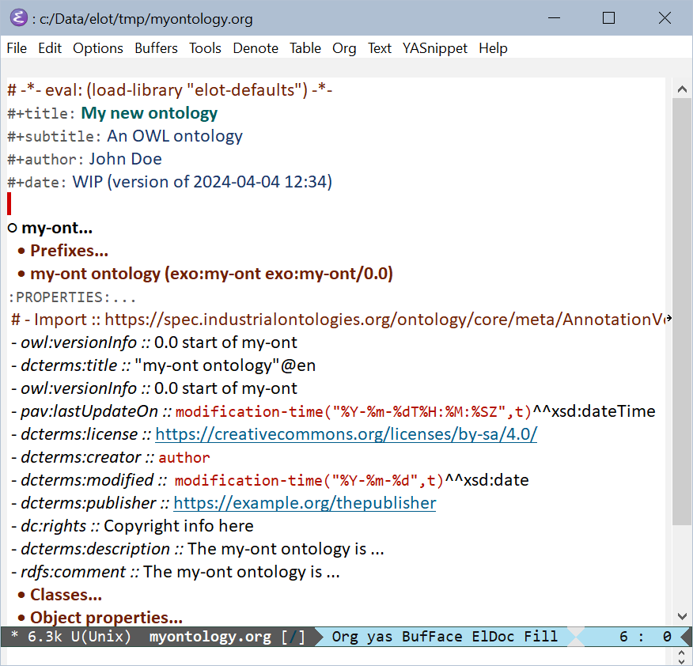

Now create an OWL file from your new document.

-   Menu entry *Export to OWL* will "tangle" the ontology to a file
    in OWL Manchester Syntax, e.g., with filename
    `myontology.omn`.
-   If you have installed ROBOT, a Turtle file named `myontology.ttl`
    will also be generated.
-   Have Protégé ready, and open the ontology file to inspect it.

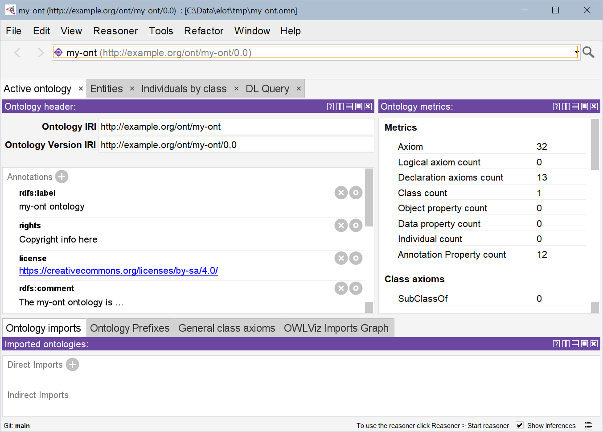

-   Export to an HTML document with menu entry *Export to HTML*. The document
    will open in your web browser.

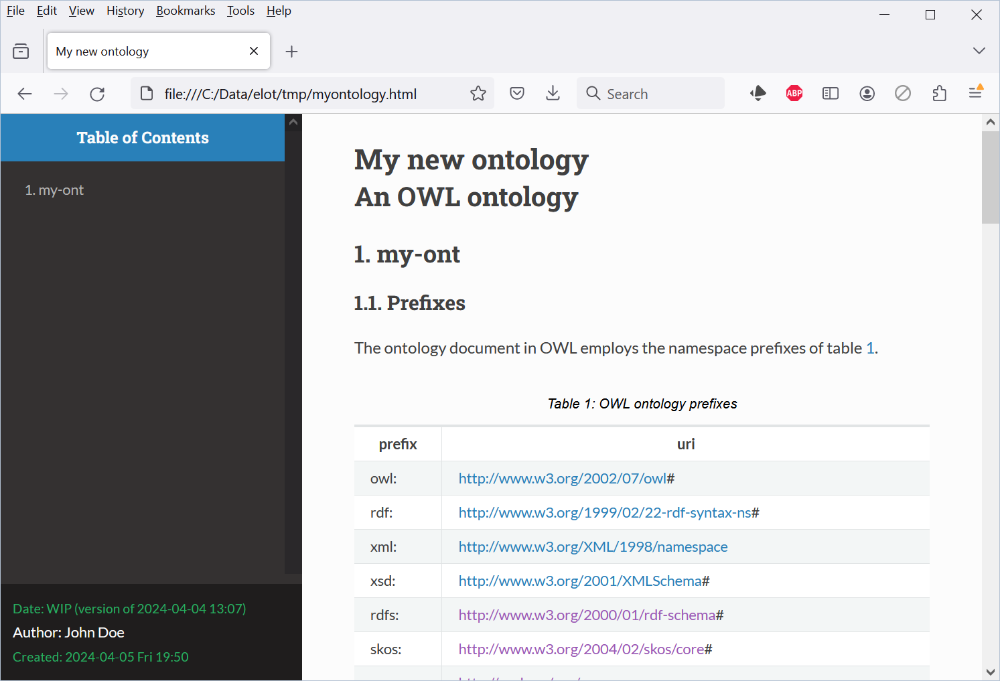


<a id="org2619c43"></a>

#### Adding classes and relations

-   Navigate to the `Classes` heading
-   Select *Insert Primitive/Defined Class template* from the menu to
    declare a class. Some appropriate annotation properties from the
    [Industrial
    Ontology Foundry Annotation Vocabulary (IOF-AV)](https://spec.industrialontologies.org/iof/ontology/core/meta/AnnotationVocabulary/) are included.
-   Navigate to the `Object properties` heading
-   Select *Insert Property template* for an object, data, or annotation
    property.
-   The screenshot shows how checkboxes are included for tracking
    progress. These are completely optional and won't appear in output.

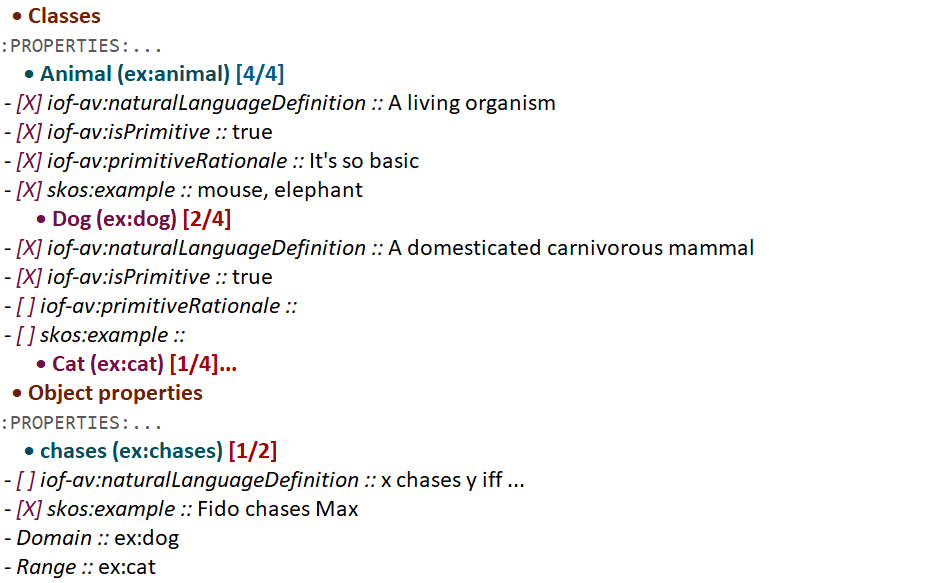


<a id="orgb39dc69"></a>

#### Adding annotations

ELOT makes it easy to add annotations to both annotations and axioms: 
just put them in a description list (` - term :: value`).
In this screenshot, two annotations are added to the "transitive" characteristic axiom:

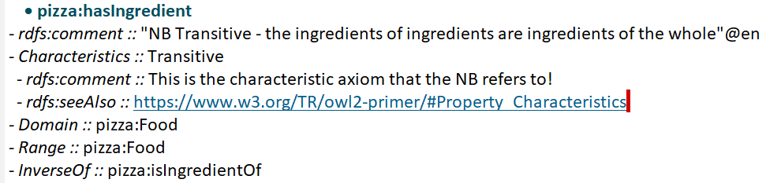


<a id="org8c7cf45"></a>

#### Querying the ontology

-   Navigate to the `Prefixes` heading and insert a new heading named
    "Queries".
-   Select menu item *Insert SPARQL Select Block*, then write a query over
    the ontology.
-   Hit `C-c C-c` to run the query.

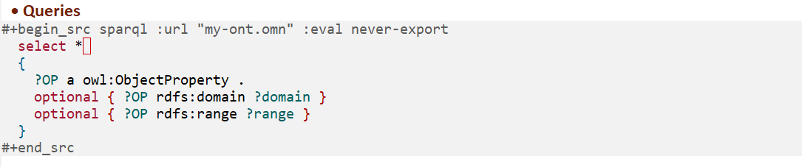


<a id="org33527b7"></a>

#### Making a diagram

-   A SPARQL *construct* query will produce Turtle code for a
    diagram. Select *Insert SPARQL Construct Block*.
-   Write a query and hit `C-c C-c` to run it.

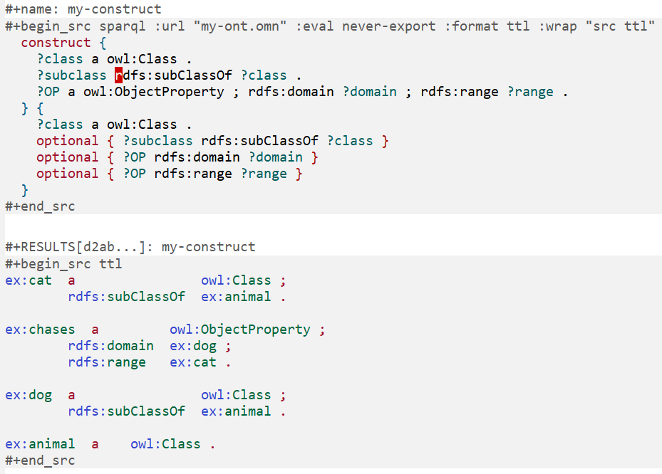

-   Select *Insert RDFPUML Diagram Block*.
-   When prompted, provide the name of the Turtle source (the name of
    the construct query) and a figure caption.
-   Place the cursor on the row of the  `#+call:` and hit `C-c C-c`. A
    diagram is generated.

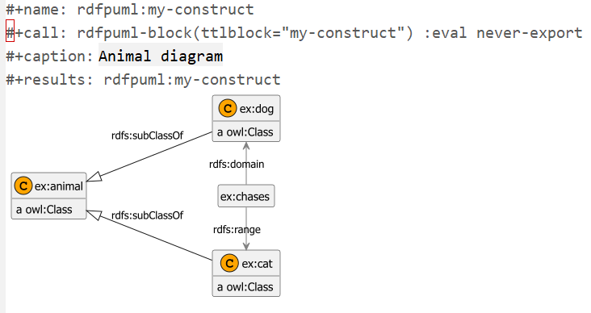

-   Select *Export to HTML* to view your ontology in a browser.

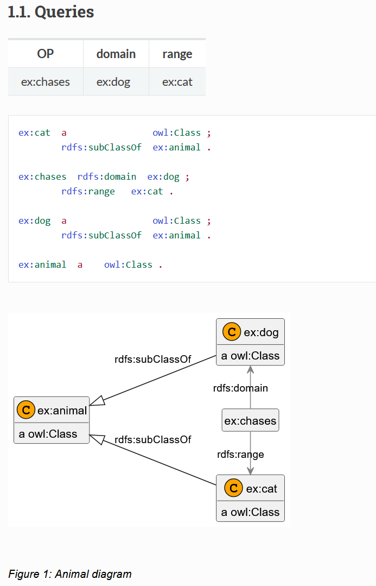


<a id="org8075a93"></a>

#### Display labels instead of identifiers

ELOT can display readable labels instead of prefixed identifiers
(which are unreadable if the identifiers are not informative), 
and offers quick search across the ontology resources. Hit F5 to toggle.

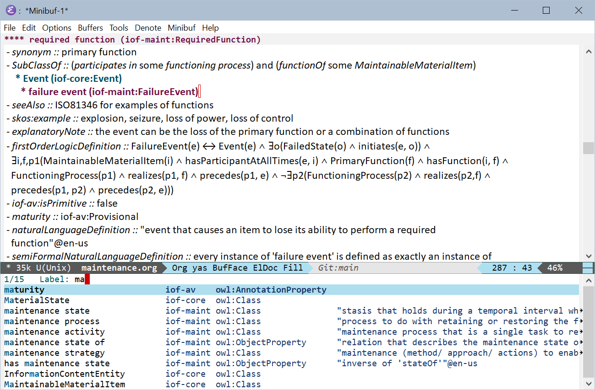


### Navigating Ontologies with Xref

ELOT supports cross-referencing and navigation using Emacs's built-in
`xref` system. This allows users to find where a resource is used
and to jump directly to its definition from anywhere in an ELOT buffer.

To find all references to a CURIE (e.g., `:BFO_0000015`), place the cursor
on it and type `M-?` (`xref-find-references`). The `*xref*` buffer will open
and show each occurrence, along with the heading and flattened description
list entry for context.

Inside the `*xref*` buffer:

-   Press `RET` to jump to the occurrence.
-   Move the cursor to any other CURIE and press `M-.` (`xref-find-definitions`)
    to jump to its definition (typically the Org headline where it's declared).

Label overlays are enabled automatically in the `*xref*` buffer, so
identifiers appear with readable labels if available. This makes it easier
to explore large ontologies interactively.

This functionality is activated automatically for Org files when `elot-mode` is active.


### HTML style

HTML output from ELOT produces stable anchors for ontology resources,
and shows readable labels with internal, clickable links.
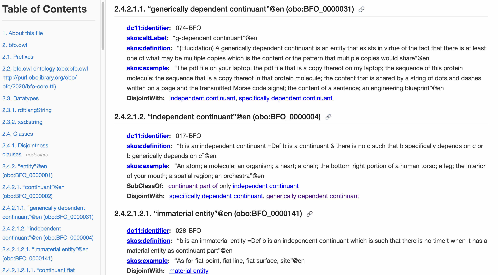

---

## Tools

Two command-line tools are included under the [`tools/`](tools/) directory:

-   **[elot-exporter](tools/elot-exporter/README.md)** — A Java CLI (OWLAPI + Maven) that converts existing OWL
    ontologies into ELOT's Org-mode format, producing a shaded JAR.

-   **[elot-cli](tools/elot-cli/README.md)** — A TypeScript CLI and VS Code extension that generates OWL
    Manchester Syntax and HTML documentation from Org-mode files (uses orgize WASM + esbuild + Pandoc).
    **Available on the [Visual Studio Marketplace](https://marketplace.visualstudio.com/items?itemName=johanwk.elot).**
