# ELOT — Literate Ontology Engineering

[](https://melpa.org/#/elot) [](https://marketplace.visualstudio.com/items?itemName=johanwk.elot)

*A single plain-text document that is simultaneously your ontology source and its documentation.*

## Why ELOT?

ELOT enables **literate ontology engineering**: a workflow, inspired by Knuth's _literate programming_, in which a plain-text notebook file is the single source for both ontology and documentation.

Headlines are the taxonomy; description lists are the axioms and annotations.
Documentation, including SPARQL queries and rdfpuml diagrams, lives alongside the formal content.
Because the source is an outline, ontology changes produce clean, human-readable diffs under version control.

ELOT has been used across scores of ontology projects, including the ISO 23726-3 Industrial Data Ontology.

## Emacs and VS Code

ELOT was developed as an Emacs package, and is now also a Visual Studio
Code extension in the [Visual Studio
Marketplace](https://marketplace.visualstudio.com/items?itemName=johanwk.elot).

-   **Emacs** — install from [MELPA](https://melpa.org/#/elot), or
    clone the repository and `(require 'elot-mode)`. This is the
    reference implementation and the maintainer's daily driver, so it
    gets new features first!
-   **VS Code** — search for "Elot" in the Extensions panel, or
    install from the
    [Marketplace](https://marketplace.visualstudio.com/items?itemName=johanwk.elot).

| | **VS Code** | **Emacs** |
|---|---|---|
| **Install** | [VS Code Marketplace](https://marketplace.visualstudio.com/items?itemName=johanwk.elot) | [MELPA](https://melpa.org/#/elot) |
| **Org→OWL** |  Built-in (WASM) |  Built-in (Elisp) |
| **OWL→Org** |  elot-exporter JAR |  elot-exporter JAR |
| **Label display** |  F5 toggle |  Menu / opt-in F5 |
| **Global label display** |  Any file via shared DB |  Any buffer via shared DB |
| **Lint for errors** |  automatic |  `elot-org-lint` |
| **Folding** |  Tab / gutter |  Native Org cycling |
| **Go to definition** |  F12 / Ctrl+Click |  M-. (xref) |
| **IntelliSense** |  Ctrl+Space |  `completing-read` |
| **SPARQL queries** | — (planned) |  `org-babel` |
| **Diagrams** | — (planned) |  rdfpuml integration |
| **HTML export** |  Built-in (Pandoc) |  `org-export` |


## The file format

-   **Headlines are the taxonomy.** Outline headings declare classes,
    properties, and individuals; their nesting expresses the
    subclass/subproperty hierarchy.
-   **Description lists are the axioms and annotations.** A list item
    attaches an annotation or an OWL axiom in Manchester Syntax to the
    entity under whose headline it appears.
-   **Nesting can relate individuals, too.** In an *Individuals*
    section, add `:ELOT-subheading-relation: skos:broader` to a
    heading's `:PROPERTIES:` drawer, and every individual nested beneath
    it asserts that relation to its *immediate* parent — inherited to
    any depth, and overridable per subtree. This is ideal for SKOS
    concept schemes, where the outline becomes the single source of
    truth for the `skos:broader` hierarchy. See
    [`examples/SKOS-example.org`](examples/SKOS-example.org).

A small excerpt — Dog is nested under Animal (so `ex:dog rdfs:subClassOf
ex:animal` follows from the structure), while the description-list items
add a definition and a Manchester-Syntax restriction:

```org
*** Animal (ex:animal)
 - iof-av:naturalLanguageDefinition :: A living organism
 - skos:example :: mouse, elephant
**** Dog (ex:dog)
 - iof-av:naturalLanguageDefinition :: A domesticated carnivorous mammal
 - SubClassOf :: ex:chases some ex:cat 
``` 

This plain-text source pairs well with any chat-based or in-editor AI
assistant. Specialised tools for LLM-assisted authoring are under
development.

## Main features

-   **Org→OWL** — Generate OWL Manchester Syntax directly
    from the Org source (and, via OBO ROBOT, Turtle).
-   **Content derived from structure** — Ontology content comes
    directly from Org headlines and description lists. A single file
    may declare multiple ontologies. Under *Individuals*, the
    `:ELOT-subheading-relation:` property extends this to relations
    such as `skos:broader`, deriving a SKOS taxonomy from the outline
    nesting.
-   **Readable label display** — Show human-readable labels instead of
    opaque CURIEs, with an in-buffer toggle in both editors. This
    works in any file — Turtle, SPARQL, CSV, source code, log files.
    A shared SQLite index fills up silently as you
    work. BCP-47 language tag preferences are honoured. See
    [README-global-label-display.org](README-global-label-display.org)
    for the Emacs guide.
-   **OWL→Org** — `elot-exporter` (Java/OWLAPI)
    converts any existing OWL ontology into the ELOT Org format so you
    can use ELOT for ontologies you already have. Download from
    [releases](https://github.com/johanwk/elot/releases); source in
    [`tools/elot-exporter/`](tools/elot-exporter/).
-   **Documentation export** — With Emacs or Pandoc, a range of output
    formats can be generated from Org documents.
-   **In-place SPARQL and diagrams** — Use the existing Org support
    for SPARQL `SELECT`/`CONSTRUCT` queries, and render
    rdfpuml/PlantUML diagrams directly in the document (Emacs only for
    now).
-   **Editor-independent CLI** — `elot-cli` (TypeScript/WASM) provides
    the Org→OWL pipeline and HTML export outside any editor, plus a `db`
    sub-command that manages the shared label index. Source in
    [`tools/elot-cli/`](tools/elot-cli/).

Note: **Java 21 or newer is required for `elot-exporter`.** Many
enterprise laptops ship with an older Java (8, 11, or 17); check with
`java -version` and upgrade if needed.

---

## Getting Started with VS Code

1. **Install the extension** from the [Visual Studio Marketplace](https://marketplace.visualstudio.com/items?itemName=johanwk.elot)
2. **Open an `.org` ontology file** — try the examples in [`tools/elot-cli/examples/`](tools/elot-cli/examples/)
3. **Hover** over a CURIE to see labels and annotations
4. **Press F5** to toggle visual label display
5. **Press Tab** on a heading to fold/unfold
6. **Press F12** on a CURIE to jump to its definition
7. **Press Ctrl+Space** to search and insert entities
8. Open the Command Palette (`Ctrl+Shift+P`) and run **Elot: Tangle to Manchester Syntax** to produce an OWL ontology.

### Importing an existing OWL ontology

1. Open the Command Palette (`Ctrl+Shift+P`) and run **Elot: Import OWL Ontology**.
2. Choose a local OWL file, or paste in a URL to a published ontology.
3. The extension downloads `elot-exporter.jar` automatically and converts the OWL file into ELOT's Org format. 
4. Save the resulting `.org` file; every ELOT feature activates as soon as it is saved.

For more details, see [extension README](tools/elot-cli/README.md).

---

## Getting Started with Emacs

### Screencast demo!

[Video.webm](https://github.com/user-attachments/assets/71a5ac3e-cafa-4180-b2a4-dbbb425b16c3)

### Install ELOT in Emacs

The quickest way is from [MELPA](https://melpa.org/#/elot): once MELPA
is in your `package-archives`, run `M-x package-install RET elot RET`,
then add `(require 'elot-mode)` to your init file. With `elot-mode`
turned on, check out the ELOT menu.

#### Install ELOT auxiliaries

-   Install [Java](https://www.java.com/en/download/help/download_options.html) to enable advanced features
 -   Turtle output, ontology metrics, and more: install [ROBOT](http://robot.obolibrary.org/)
 -   Ontology diagrams: install [PlantUML](https://plantuml.com/) and [rdfpuml](https://github.com/VladimirAlexiev/rdf2rml)
 -   Open OWL files: Download `elot-exporter` from [releases](https://github.com/johanwk/elot/releases)

---

## Walkthrough: Adding an ontology

(This is for Emacs, but should transfer to VS Code well enough.)

-   Select a directory that you want to work in. Open a new Org Mode
    file, for instance `myontology.org`.
-   Insert the ELOT template for a document header.
    From the ELOT menu, select *Insert New Ontology Document Header*.
    Answer the prompts, and a header is produced, like the following.
    
        #+title: My new ontology
        #+subtitle: An OWL ontology
        #+author: John Doe
        #+date: WIP (version of 2024-04-04 12:34)
-   Insert the ELOT template for an ontology skeleton: menu entry
    *Insert New Ontology Skeleton*. Answer the prompts — be
    ready to provide namespaces/prefixes for your ontology and the
    resources it will contain. You should see something like this
    screenshot:

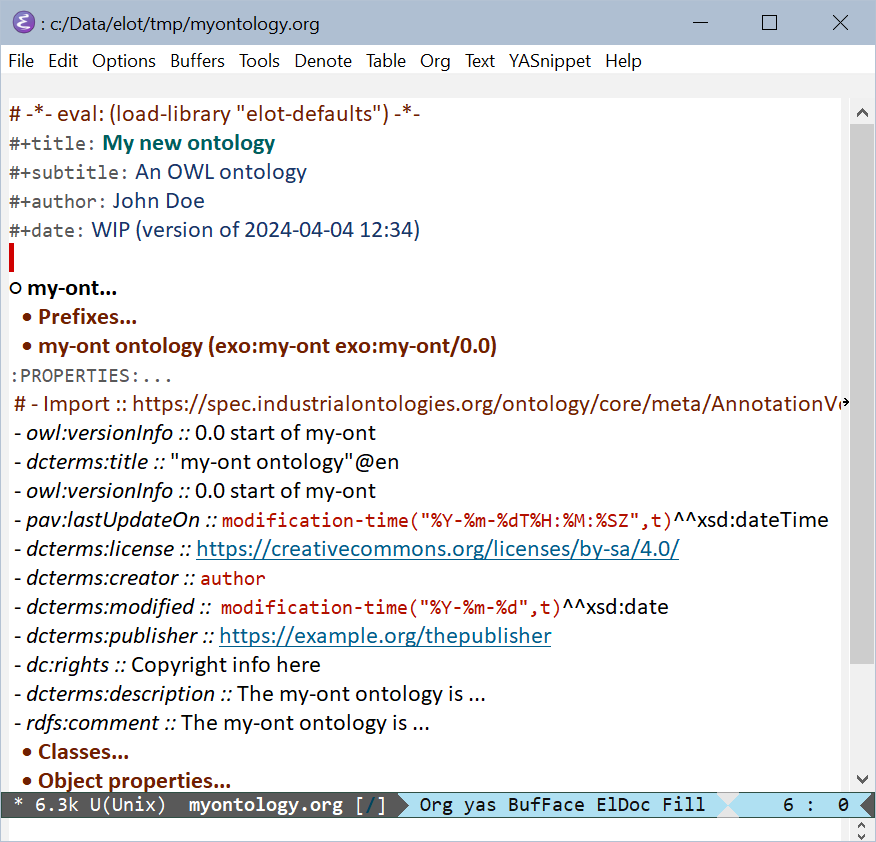

Now create an OWL file from your new document.

-   Menu entry *Export to OWL* will "tangle" the ontology to a file
    in OWL Manchester Syntax, e.g., with filename
    `myontology.omn`.
-   If you have installed ROBOT, a Turtle file named `myontology.ttl`
    will also be generated.
-   Have Protégé ready, and open the ontology file to inspect it.

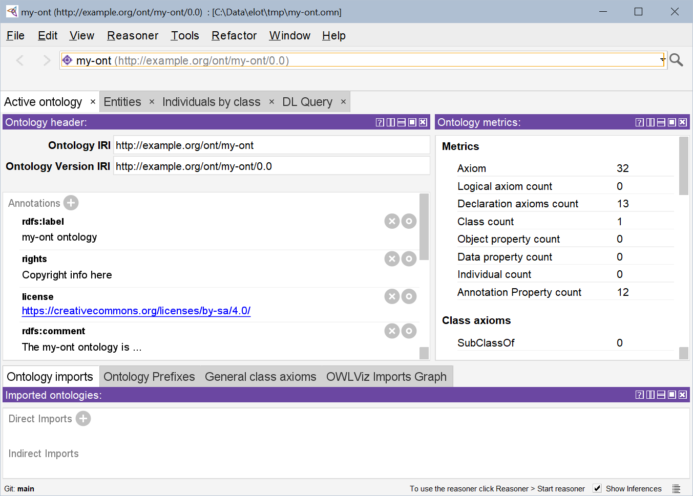

-   Export to an HTML document with menu entry *Export to HTML*. The document
    will open in your web browser.

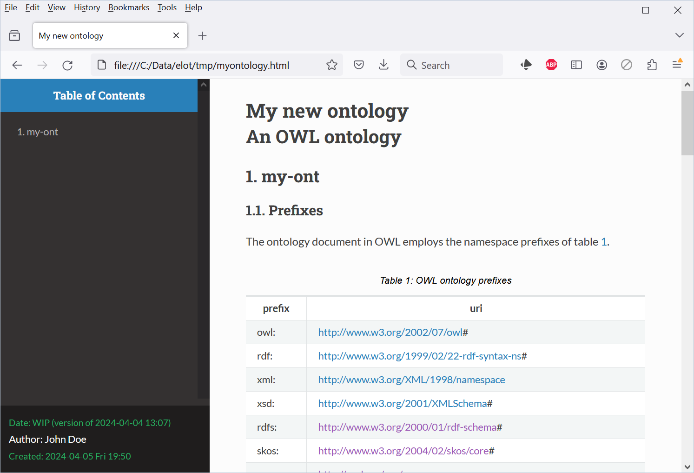


<a id="org2619c43"></a>

#### Adding classes and relations

-   Navigate to the `Classes` heading
-   Select *Insert Primitive/Defined Class template* from the menu to
    declare a class. Some appropriate annotation properties from the
    [Industrial
    Ontology Foundry Annotation Vocabulary (IOF-AV)](https://spec.industrialontologies.org/iof/ontology/core/meta/AnnotationVocabulary/) are included.
-   Navigate to the `Object properties` heading
-   Select *Insert Property template* for an object, data, or annotation
    property.
-   The screenshot shows how checkboxes are included for tracking
    progress. These are completely optional and won't appear in output.

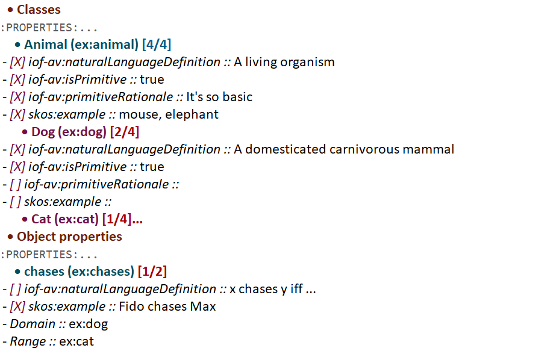


<a id="orgb39dc69"></a>

#### Adding annotations

ELOT makes it easy to add annotations to both annotations and axioms: 
just put them in a description list (` - term :: value`).
In this screenshot, two annotations are added to the "transitive" characteristic axiom:

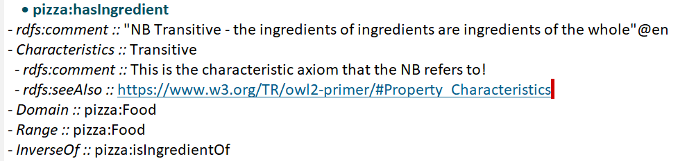


<a id="org8c7cf45"></a>

#### Querying the ontology

-   Navigate to the `Prefixes` heading and insert a new heading named
    "Queries".
-   Select menu item *Insert SPARQL Select Block*, then write a query over
    the ontology.
-   Hit `C-c C-c` to run the query.

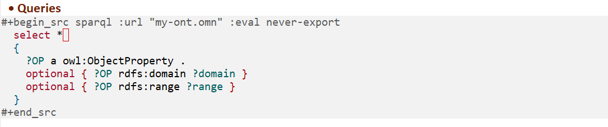


<a id="org33527b7"></a>

#### Making a diagram

-   A SPARQL *construct* query will produce Turtle code for a
    diagram. Select *Insert SPARQL Construct Block*.
-   Write a query and hit `C-c C-c` to run it.

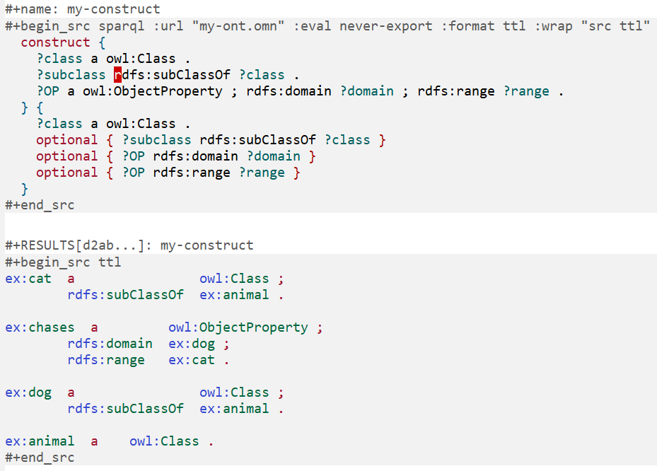

-   Select *Insert RDFPUML Diagram Block*.
-   When prompted, provide the name of the Turtle source (the name of
    the construct query) and a figure caption.
-   Place the cursor on the row of the  `#+call:` and hit `C-c C-c`. A
    diagram is generated.

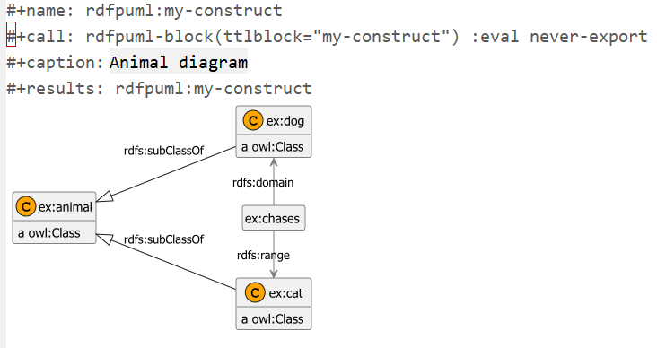

-   Select *Export to HTML* to view your ontology in a browser.

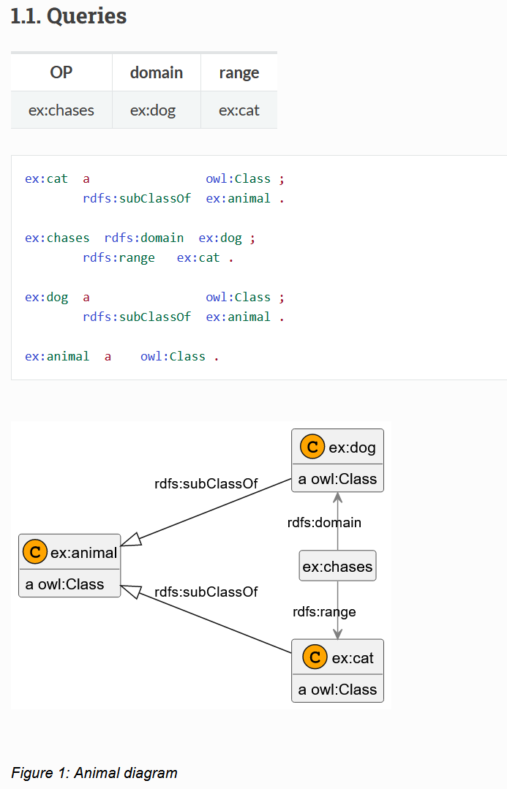


#### Display labels instead of identifiers

ELOT can display readable labels instead of prefixed identifiers
(which are unreadable if the identifiers are not informative), 
and offers quick search across the ontology resources.  Toggle
from the *ELOT* menu or with `M-x elot-toggle-label-display`.

ELOT does not assign a default key for the label-display toggle.  To
get a keybinding, customize `elot-toggle-labels-key` (`M-x
customize-variable RET elot-toggle-labels-key`) to a `kbd`-notation
string — for example `<f5>`, `<f9>`, or `C-c t l`.  When set, ELOT
installs the binding in `elot-mode-map` and in the ELOT-managed
`*xref*` / `*ELOT Describe*` buffers.

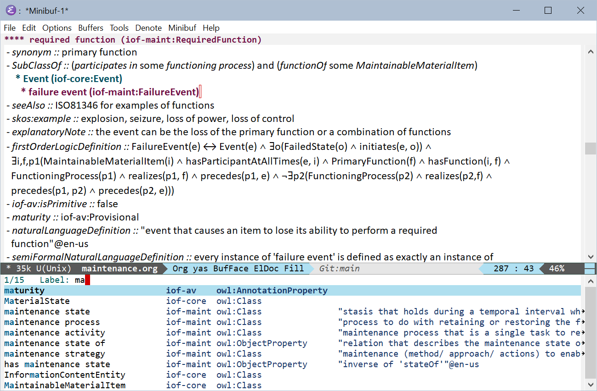


### Global label-display: labels everywhere, automatically

ELOT's label-display is no longer confined to Org buffers. The minor mode
`elot-global-label-display-mode` lights up readable labels in *any* buffer
— `.ttl` files, SPARQL queries, CSV exports, even source code and log files
that mention ontology identifiers. Toggle from the *ELOT* menu or via
`M-x elot-toggle-label-display` (or your chosen keystroke if you
set one — see `elot-toggle-labels-key`).

The feature that makes this practical in daily work: **id/label mappings are
collected silently and automatically as you edit ELOT Org files**. Every
ontology you open, tangle, or save contributes its declarations to a
persistent SQLite index (`elot-db`) that lives across sessions. The more
ontologies you touch, the richer the index becomes — with no explicit
import step, no manual curation, and no rebuild when you come back
tomorrow. Additional sources (TTL via ROBOT, SPARQL endpoints, CSV/TSV/JSON
exports) can be registered per-buffer via `.dir-locals.el`.

Beyond the visual overlays, the mode provides:

-   **`elot-label-lookup`** (`C-c C-x r`) — Insert an existing resource
    identifier by searching on its label. Scope is configurable (current
    buffer only, external sources only, or a union of both). When many
    identifiers share a label — common in industrial asset data — a
    two-stage picker lets you drill down with full attribute context.
-   **Attribute-driven hover** — Idle the cursor on any identifier to see
    its `rdf:type`, definition, and source provenance in the echo area.
-   **Language preferences** — Multi-lingual ontologies (e.g. English +
    Korean) display the right variant based on `elot-preferred-languages`;
    the default policy is untagged first, then `@en`, then alphabetical.

See [README-global-label-display.org](README-global-label-display.org) for
configuration, source registration, and language-preference details.


### Identifier schemes (`ELOT-id-scheme`)

Different ontology projects use very different conventions for the
*local-name* part of their resource IRIs — OBO uses zero-padded
counters like `GO_0000001`, ISO 15926-style libraries use prefixed
counters like `RDS123456789`, some projects use UUIDs, some use
human-readable slugs.  ELOT does not bake in a single convention.
Instead, each ontology *declares* the scheme it uses, as a property
of its top-level heading (sibling of `ELOT-default-prefix`):

```org
* my-ont
:PROPERTIES:
:ELOT-context-type:      ontology
:ELOT-id-scheme:         counter GO_0000000
:ELOT-context-localname: my-ont
:ELOT-default-prefix:    ex
:END:
```

The property value is `SCHEME [FORMAT...]`.  Four built-in schemes
are available:

| Spec                       | Sample local name              | Notes                                                |
|----------------------------|-------------------------------|-----------------------------------------------------|
| `uuid`                     | `9af6a481-c172-4858-9d44-...` | RFC 4122 UUID; maximum collision resistance         |
| `slug`                     | `donkey`, `dog-2`             | kebab-case from label; numeric suffix on collision  |
| `counter GO_0000000`       | `GO_0000001`, `GO_0000002`    | OBO/PCA-style: literal alpha part + zero-padded N   |
| `acme`                     | `C_028QZQ8C4`                 | 11-char date+random+checksum, no project state      |
| `acme slug:t`              | `C_dogxx028QZQ8C4`            | 16-char acme with 5-char label slug prepended       |

The counter template *literally* shows the output shape: leading
non-digit run = alpha prefix, trailing run of `0` s = pad width.
Numeric-only counters (no alpha prefix) are technically invalid XML
NCNames, so declaring a template such as `GO_0000000`, `ABC_00000`,
or `CHEBI00000` is recommended.

The declaration is consumed by ELOT's LLM-facing tools
(`elot_mint_identifier`, `elot_verify_identifier` in
[elot-gptel.el](elot-package/elot-gptel.el)) so that AI-assisted
authoring produces identifiers matching the project's convention
automatically.  When no scheme is declared the tools refuse to
guess and direct the agent to ask the user.

See [documentation/elot-id.org](documentation/elot-id.org) for the
full reference, including the `CONTEXT` plist surface and how to
register a custom scheme.


### Optional integration: AI-assisted authoring with gptel

ELOT ships a set of tools that let a large language model (LLM)
inspect, validate, and — with your confirmation — edit your ontology
files, driven from a chat session inside Emacs. The tools are built
on [gptel](https://github.com/karthink/gptel), the Emacs LLM client.

Both gptel and ROBOT are **optional**: ELOT works fully without them.
If gptel is installed, enable the tools with:

```elisp
(with-eval-after-load 'gptel
  (require 'elot-gptel)
  (elot-gptel-register-tools))
```

or interactively with `M-x elot-gptel-register-tools`. Read-only
tools (lint, search, label lookup) work out of the box; tools that
modify files are additionally gated behind the user option
`elot-gptel-allow-side-effects`, and the reasoning/validation tools
require ROBOT to be installed.

See [documentation/elot-gptel.org](documentation/elot-gptel.org) for
the full user guide — how to work with the LLM on an ELOT file,
recommended workflows, the safety model, and a reference of all
tools.


### Supported `#+call:` helpers (Library of Babel)

ELOT ships a small Library of Babel file
([`elot-package/elot-lob.org`](elot-package/elot-lob.org))
that defines a handful of named source blocks intended to be invoked
from your ontology Org files via Org's `#+call:` syntax. When
`elot-mode` is enabled in a buffer, ELOT automatically ingests the
file (via `org-babel-lob-ingest`) so the helpers below are available
without any manual setup — no `M-x org-babel-lob-ingest` step
required.

The supported helpers are:

- **`rdfpuml-block`** — render a Turtle (or SPARQL `CONSTRUCT`) source
  block as an rdfpuml/PlantUML diagram. Takes the *name* of another
  named block as its `ttlblock` argument, plus optional `config`,
  `add-options`, `epilogue` and `format` arguments. Produces an
  image file referenced from the surrounding caption.
- **`kill-prefixes`** — strip leading `@prefix` / `PREFIX` declarations
  from a Turtle string. Most commonly used as a `:post` hook on a
  SPARQL `CONSTRUCT` block to keep the visible result compact.
- **`robot-metrics`** — run `robot measure` on an OMN file and return
  the resulting table.
- **`robot-sparql-select`** — run a named SPARQL query through ROBOT
  against a local OMN file and return the result as an Org table.
- **`theme-elot`** — expands to the right
  `#+SETUPFILE:` line for the HTML theme. 
- **`current-date` / `current-datetime`** — format the current
  date/time, useful in `pav:lastUpdateOn` annotations.

A minimal example, taken from
[`examples/pets.org`](examples/pets.org), showing
`rdfpuml-block` consuming a CONSTRUCT block whose result is also
post-processed by `kill-prefixes`:

```org
#+name: my-construct
#+begin_src sparql :url "my-ont.omn" :format ttl :wrap "src ttl" \
                  :cache yes :post kill-prefixes(data=*this*)
  construct {
    ?class a owl:Class .
    ?subclass rdfs:subClassOf ?class .
  } {
    ?class a owl:Class .
    optional { ?subclass rdfs:subClassOf ?class }
  }
#+end_src

#+name: rdfpuml:my-construct
#+call: rdfpuml-block(ttlblock="my-construct")
#+caption: Animal diagram
```

Place point on the `#+call:` line and hit `C-c C-c` to render the
diagram. See `examples/pets.org` for the complete working file.

**id/label mappings are collected silently and automatically as you
edit ELOT Org files**, into a persistent SQLite index (`elot-db`) that
lives across sessions. The more ontologies you touch, the richer the
index becomes. Default sources  can be registered per project via
`.dir-locals.el`.

### Navigating Ontologies with Xref

ELOT supports cross-referencing and navigation using Emacs's built-in
`xref` system. This allows users to find where a resource is used
and to jump directly to its definition from anywhere in an ELOT buffer.

To find all references to a CURIE (e.g., `:BFO_0000015`), place the cursor
on it and type `M-?` (`xref-find-references`). The `*xref*` buffer will open
and show each occurrence, along with the heading and flattened description
list entry for context.

Inside the `*xref*` buffer:

-   Press `RET` to jump to the occurrence.
-   Move the cursor to any other CURIE and press `M-.` (`xref-find-definitions`)
    to jump to its definition (typically the Org headline where it's declared).

Label overlays are enabled automatically in the `*xref*` buffer, so
identifiers appear with readable labels if available. This makes it easier
to explore large ontologies interactively.

This functionality is activated automatically for Org files when `elot-mode` is active.


### HTML style

HTML output from ELOT produces stable anchors for ontology resources,
and shows readable labels with internal, clickable links.
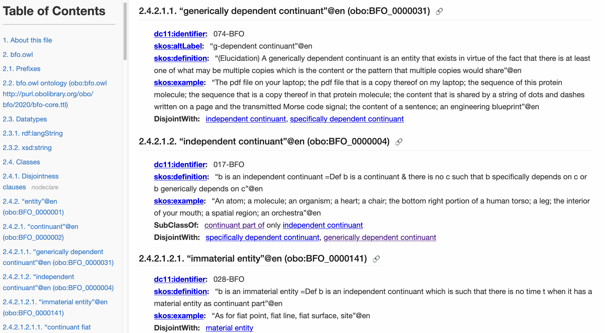

---

## Tools

Two command-line tools are included under the [`tools/`](tools/) directory:

-   **[elot-exporter](tools/elot-exporter/README.md)** — A Java CLI (OWLAPI + Maven) that converts existing OWL
    ontologies into ELOT's Org-mode format, producing a shaded JAR.

-   **[elot-cli](tools/elot-cli/README.md)** — A TypeScript CLI and VS Code extension that generates OWL
    Manchester Syntax and HTML documentation from Org-mode files (uses orgize WASM + esbuild + Pandoc).
    Also provides a `db` sub-command (`elot-cli db init|register|refresh|list|lookup|attr|remove`)
    that manages the persistent SQLite label index used by the global label-display
    feature; see [the `Label Database` section in the elot-cli README](tools/elot-cli/README.md#label-database-elot-cli-db).
    **Available on the [Visual Studio Marketplace](https://marketplace.visualstudio.com/items?itemName=johanwk.elot).**
