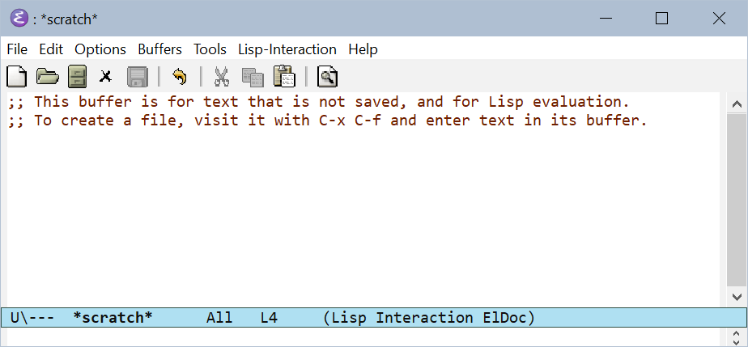

# Documentation on ELOT for new EMACS users

The aim of this documentation is to provide instructions to support the installation of ELOT.

These instructions are for a Windows user with no previous EMACs experience.

### System requirements

This installation was performed on a personal Dell XPS13 laptop running Microsoft Windows 10 Home. The computer has an external virus protection system (Norton) but this did not appear to impact the installation.

It is necessary to make sure Protege 5.6 (not 5.5) is running.

### Download EMACS

1. Go to the https://ftp.gnu.org/gnu/emacs/windows/emacs-29/ and download the latest version of emacs-vv.v-installer.exe
2. Go to the downloads file on your c: drive and run the .exe file.
3. As the download file expands make sure the files/folder are stored in a directory path with no spaces. For example avoid a path with "Program Files" as a subdirectory. For example C:\Users\myname\bin . Do not allow the files to be stored in a OneDrive folder, use your hard drive.
4. Tick the option to allow the .exe to create a path.

### Setting up ELOT subdir

1. Clone the elot GitHub at https://github.com/johanwk/elot
2. Create a subdir on your C: drive, for example C:\Users\myname\elisp
3. Copy the elot subdir from your GitHub to elisp

### EMACS start up configuration

1. In this documentation directory there is a file ATT30846.emacs. Copy this file to C:\Users\myname\ and rename it .emacs
2. Open the file and edit the line that says (push (expand-file-name "~/../elot-package/") load-path) so that it points to the location of your checked-out copy of ELOT in the subdir you have stored it (see above). Note that you need to point to elot/elot-package, the subdirectory inside the checked-out copy, not to elot itself.
3. Start emacs by typing emacs into the Windows start bar. You should see a screen come up looking like the following.
   
