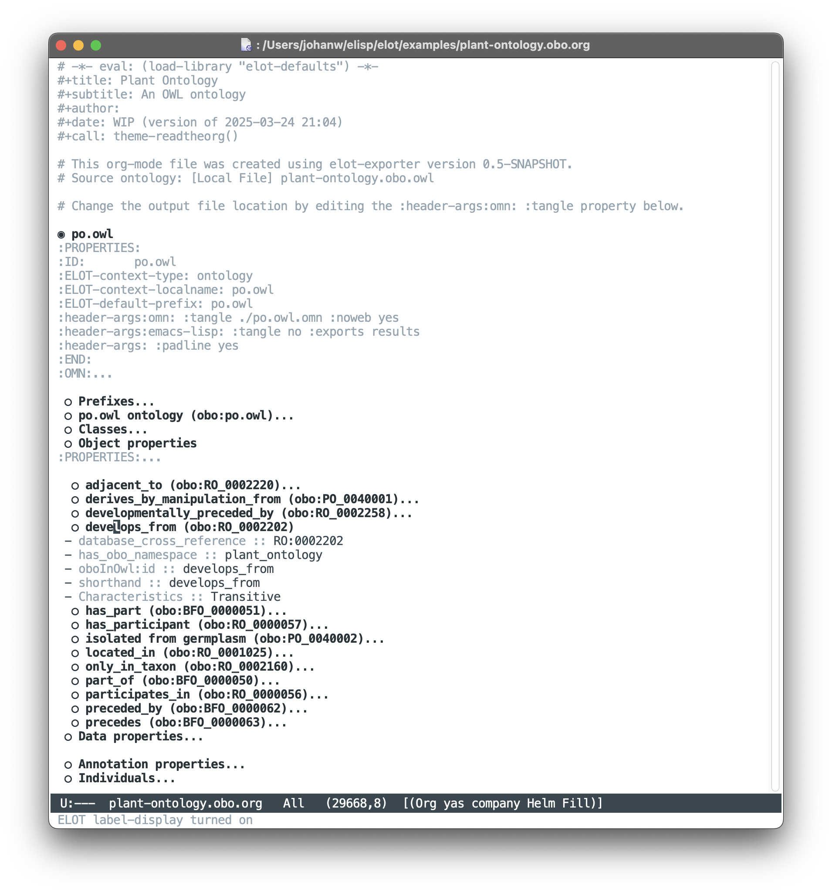

# Table of Contents

1.  [Examples made with `elot-exporter` jar](#orgedf5c04)
    1.  [Cell Ontology](#orgd189fa0)
    2.  [Units of Measure](#org27e419b)
    3.  [UBERON](#org7a539d6)
    4.  [CIM Equipment](#org925701f)
    5.  [BFO-2020](#org2cd0189)
    6.  [Plant Ontology](#org9f23b25)
2.  [Other examples](#orgc73bd48)
    1.  [Maintenance](#org8404d31)
    2.  [Pizza](#org4c86b8b)

# Examples made with `elot-exporter` jar

These examples are generated with the `elot-exporter` (see <https://github.com/johanwk/elot/releases>), eg:

    java -jar elot-exporter-0.3-SNAPSHOT.jar ontology.ttl > ontology.org

## Cell Ontology

[cl-basic.org](./cl-basic.md): 2.2Mb

CL-basic from <http://purl.obolibrary.org/obo/cl/cl-basic.owl>.
This is part of the Cell Ontology, see <https://www.ebi.ac.uk/ols4/ontologies/cl> and <http://purl.obolibrary.org/obo/cl.owl>.

## Units of Measure

[om-2.org](./om-2.md): 840kB

Ontology of Units of Measure from <http://www.ontology-of-units-of-measure.org/page/om-2>

## UBERON

[uberon.org](./uberon.md): 29Mb

Uberon Multi-species Anatomy Ontology from <https://obophenotype.github.io/uberon/> and <http://purl.obolibrary.org/obo/uberon.owl>.

Warning: 

-   The file is very large. `elot` startup code has been removed from that file to speed up loading.
-   But still, Emacs may hang for a very long time before responding (eg 10 minutes). So it's perhaps better to use `find-file-literally` to avoid that.

## CIM Equipment

[BROKEN LINK: 61970-600-2\_Equipment-AP-Voc-RDFS2020\_v3-0-0.org]: 305kB

Electrical CIM: equipment ontology from [61970-600-2\_Equipment-AP-Voc-RDFS2020\_v3-0-0.ttl](https://github.com/Sveino/Inst4CIM-KG/blob/develop/rdfs-improved/CGMES/ttl/61970-600-2_Equipment-AP-Voc-RDFS2020_v3-0-0.ttl)

## BFO-2020

[bfo-core.org](bfo-core.md)

Basic Formal Ontology (BFO-2020) from <https://github.com/BFO-ontology/BFO-2020/releases/tag/release-2024-01-29>.
An "About" section has been added after conversion.

## Plant Ontology

[BROKEN LINK: plant-ontology.obo.org]: 1.8M

Plant Ontology from <https://github.com/Planteome/plant-ontology/releases>

# Other examples

These examples were made before the `elot-exporter` was available. They
will eventually be updated, once the exporter is more complete.

## Maintenance

[maintenance.org](maintenance.md)

This is the Industrial Ontology Foundry (IOF) Maintenance ontology, from <https://spec.industrialontologies.org/iof/ontology/maintenance/Maintenance/>.

This example is noteworthy for showing how ELOT's *label display* feature simplifies working with non-informative resource identifiers from BFO. 
E.g. a subclass axiom like the following, from the class *failure effect* ([iof-maint:FailureEffect](https://spec.industrialontologies.org/iof/ontology/maintenance/Maintenance/FailureEffect)), appears in the buffer as the list entry

> -   **SubClassOf:** *preceded by* some (*failure event* or *failure process*)

which is much better than

> -   **SubClassOf:** obo:BFO\_0000062 some (iof-maint:FailureEvent or iof-maint:FailureProcess)

## Pizza

[pizza.org](pizza.md)

This is the famous Pizza ontology used in well-known tutorials.

This example is useful for containing sections with ROBOT metrics,
SPARQL queries, and an *rdfpuml* diagram.

