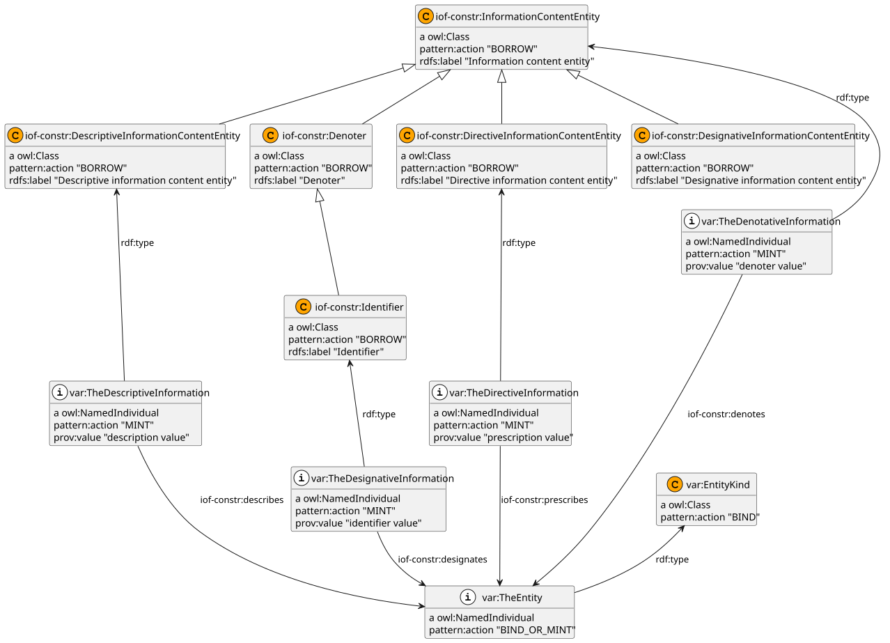

#+title: IOF modelling pattern: information about an entity
#+subtitle: An OWL ontology
#+author: johanw
#+date: Created 2026-08-10
#+call: theme-elot()
#+OPTIONS: tags:nil

See [[file:pattern-framework.org][pattern-framework.org]] for the framework, [[file:pattern-vocabulary.org][pattern-vocabulary.org]] for
the =pattern:= vocabulary, and [[file:README.org][README.org]] for the library index.

The following diagram provides a quick overview of the pattern. It
shows the four independent information modes—denotation, designation,
description, and prescription—sharing a common subject. Detailed
application guidance and semantic commitments follow below.
#+name: pattern-information-about-all
#+begin_src sparql :url "./IOF-pattern-information-about.omn" :eval never-export :exports results :format ttl :wrap "src ttl" :cache yes :post kill-prefixes(data=*this*) :eval never-export
  PREFIX puml: <http://plantuml.com/ontology#>
  construct {
    ?x ?y ?z .
    rdf:type puml:arrow puml:up .
  } {
    # the pattern diagram is best with only classes and individuals
    values ?type { owl:Class owl:NamedIndividual }
    ?x ?y ?z .
    ?x a ?type .
    filter( ?y != rdfs:isDefinedBy )
    filter( ?y != pattern:instruction )
  }
#+end_src

#+RESULTS[e851a9af1d132721923f82d90cead2f3c721e2c5]: pattern-information-about-all
#+begin_src ttl

iof-constr:DescriptiveInformationContentEntity
        a                owl:Class ;
        rdfs:label       "Descriptive information content entity" ;
        rdfs:subClassOf  iof-constr:InformationContentEntity ;
        pattern:action   "BORROW" .

var:TheDescriptiveInformation
        a                     owl:NamedIndividual , iof-constr:DescriptiveInformationContentEntity ;
        pattern:action        "MINT" ;
        prov:value            "description value" ;
        iof-constr:describes  var:TheEntity .

bfo:BFO_0000001  a      owl:Class ;
        rdfs:label      "Entity" ;
        pattern:action  "BORROW" .

iof-constr:DirectiveInformationContentEntity
        a                owl:Class ;
        rdfs:label       "Directive information content entity" ;
        rdfs:subClassOf  iof-constr:InformationContentEntity ;
        pattern:action   "BORROW" .

rdf:type  puml:arrow  puml:up .

var:TheDenotativeInformation
        a                   owl:NamedIndividual , iof-constr:InformationContentEntity ;
        pattern:action      "MINT" ;
        prov:value          "denoter value" ;
        iof-constr:denotes  var:TheEntity .

iof-constr:Denoter  a    owl:Class ;
        rdfs:label       "Denoter" ;
        rdfs:subClassOf  iof-constr:InformationContentEntity ;
        pattern:action   "BORROW" .

var:TheDesignativeInformation
        a                      owl:NamedIndividual , iof-constr:Identifier ;
        pattern:action         "MINT" ;
        prov:value             "identifier value" ;
        iof-constr:designates  var:TheEntity .

var:TheEntity  a        owl:NamedIndividual , var:EntityKind ;
        pattern:action  "BIND_OR_MINT" .

var:EntityKind  a        owl:Class ;
        rdfs:subClassOf  bfo:BFO_0000001 ;
        pattern:action   "BIND" .

iof-constr:Identifier
        a                owl:Class ;
        rdfs:label       "Identifier" ;
        rdfs:subClassOf  iof-constr:Denoter ;
        pattern:action   "BORROW" .

iof-constr:InformationContentEntity
        a               owl:Class ;
        rdfs:label      "Information content entity" ;
        pattern:action  "BORROW" .

var:TheDirectiveInformation
        a                      owl:NamedIndividual , iof-constr:DirectiveInformationContentEntity ;
        pattern:action         "MINT" ;
        prov:value             "prescription value" ;
        iof-constr:prescribes  var:TheEntity .

iof-constr:DesignativeInformationContentEntity
        a                owl:Class ;
        rdfs:label       "Designative information content entity" ;
        rdfs:subClassOf  iof-constr:InformationContentEntity ;
        pattern:action   "BORROW" .
#+end_src

#+name: rdfpuml:pattern-information-about-all
#+call: rdfpuml-block(ttlblock="pattern-information-about-all") :eval never-export :var add-options="top to bottom direction"
#+caption: Information about an entity
#+results: rdfpuml:pattern-information-about-all

* IOF-pattern-information-about
:PROPERTIES:
:ID:       IOF-pattern-information-about
:ELOT-context-type: ontology
:ELOT-context-localname: IOF-pattern-information-about
:ELOT-default-prefix: var
:header-args:omn: :tangle ./IOF-pattern-information-about.omn :noweb yes
:header-args:emacs-lisp: :tangle no :exports results
:header-args: :padline yes
:END:

** Prefixes
:PROPERTIES:
:prefixdefs: yes
:END:

#+caption: OWL ontology prefixes
| prefix      | uri                                                           |
|-------------+---------------------------------------------------------------|
| owl:        | http://www.w3.org/2002/07/owl#                                |
| rdf:        | http://www.w3.org/1999/02/22-rdf-syntax-ns#                   |
| xml:        | http://www.w3.org/XML/1998/namespace                          |
| xsd:        | http://www.w3.org/2001/XMLSchema#                             |
| rdfs:       | http://www.w3.org/2000/01/rdf-schema#                         |
| skos:       | http://www.w3.org/2004/02/skos/core#                          |
| dc:         | http://purl.org/dc/elements/1.1/                              |
| dcterms:    | http://purl.org/dc/terms/                                     |
| prov:       | http://www.w3.org/ns/prov#                                    |
| bfo:        | http://purl.obolibrary.org/obo/                               |
| iof-constr: | https://spec.industrialontologies.org/ontology/construct/     |
| iof-core:   | https://spec.industrialontologies.org/ontology/core/Core/     |
| var:        | http://example.org/variable/                                  |
| pattern:    | http://example.org/pattern/                                   |

** IOF-pattern-information-about ontology (pattern:IOF-pattern-information-about pattern:IOF-pattern-information-about/0.0)
:PROPERTIES:
:ID:       IOF-pattern-information-about-ontology-declaration
:resourcedefs: yes
:END:
 - owl:versionInfo :: 0.0 start of IOF-pattern-information-about
 - dcterms:creator :: https://orcid.org/0000-0002-7167-7321
 - dcterms:modified :: {{{time("%Y-%m-%d")}}}^^xsd:date
 - dcterms:description :: This ontology is an IOF modelling pattern for information about an entity. It distinguishes information that denotes an entity, designates one entity uniquely, describes an entity, or prescribes rules, guidance, or a model for an entity. Each information content entity may carry its structured literal with prov:value.
 - Import :: pattern:pattern-vocabulary
 - Import :: iof-core:
 - dcterms:source :: https://github.com/iofoundry/IOF-Core-Pattern-v2
 - dcterms:source :: https://github.com/iofoundry/IOF-Core-Pattern-v2/blob/20fc8fbfc203fab4c452a1292adc354b4ec36763/scenarios/information-and-aboutness/information-and-aboutness.tex
 - dcterms:contributor :: "Arkopaul Sarkar"
 - dcterms:bibliographicCitation :: "Sarkar, Arkopaul. Information about some entity(s). IOF Core Pattern v2 repository."
 - rdfs:seeAlso :: https://github.com/iofoundry/IOF-Core-Pattern-v2
 - dcterms:description :: This ontology is an ELOT adaptation of the IOF “Information about some entity(s)” pattern by Arkopaul Sarkar in the IOF Core Pattern v2 repository.

*** How to apply this pattern                                   :nodeclare:
:PROPERTIES:
:ID: IOF-pattern-information-about-howto
:END:

The generic procedure is in [[file:pattern-framework.org::*Applying a pattern: the generic procedure][Applying a pattern: the generic
procedure]]. Specific to /this/ pattern:

- *Start with the aboutness mode, not the text.* Choose the IOF
  relation according to how the information refers to its subject:
  ~iof-constr:denotes~ distinguishes one or more entities;
  ~iof-constr:designates~ uniquely distinguishes one entity;
  ~iof-constr:describes~ characterizes an entity; and
  ~iof-constr:prescribes~ provides rules, guidance, or a model that its
  subject is expected to follow or conform to.
- *Do not use ~designates~ merely because a value looks like a name.*
  It is functional and therefore commits each designative information
  content entity to one subject. Use it for a VIN, serial number, URI,
  or another identifier that is unique in the relevant context. Use
  ~denotes~ for a model name or other non-unique denoter.
- *The relation is semantically primary.* IOF defines descriptive,
  designative, and directive information-content classes using these
  relations. The class may therefore be inferred when the corresponding
  relation is asserted. The explicit types retained in this template
  mirror the source scenario and make the intended mode visible to
  consumers that do not reason.
- *Use ~prov:value~ only for the structured value itself.* PROV-O defines
  it as providing a value that directly represents an entity. The
  aboutness relation says what the information is about; ~prov:value~
  merely carries its lexical content. Do not interpret ~prov:value~ as
  denotation, description, or prescription.
- *Bind the subject before minting information resources.* The same
  entity may be the subject of several information content entities.
  Search for and reuse it; do not mint a duplicate merely to apply this
  pattern.

*** Arity and optional legs                                      :nodeclare:
:PROPERTIES:
:ID: IOF-pattern-information-about-arity
:END:

The complete template has four independent information legs sharing one
subject. Use all four when all four modes are present, as in the worked
car example. When source material supplies only some modes, instantiate
only those legs; do not invent an identifier, description, denoter, or
directive to fill the skeleton.

The current pattern vocabulary has no active optional-cardinality
semantics, so this selection is an application instruction rather than a
machine-expanded ~pattern:cardinality~ declaration. Repeated information
of one mode is handled by binding ~var:TheEntity~ and applying that leg
again with a newly minted information resource.

*** Required constants (borrow these first)                     :nodeclare:
:PROPERTIES:
:ID: IOF-pattern-information-about-constants
:END:

From IOF Core:

- classes: ~iof-constr:InformationContentEntity~,
  ~iof-constr:Identifier~,
  ~iof-constr:DescriptiveInformationContentEntity~, and
  ~iof-constr:DirectiveInformationContentEntity~;
- the inferred class ~iof-constr:DesignativeInformationContentEntity~;
- properties: ~iof-constr:denotes~, ~iof-constr:designates~,
  ~iof-constr:describes~, and ~iof-constr:prescribes~.

The common range is ~bfo:BFO_0000001~ (entity). The value carrier is
~prov:value~, defined by PROV-O as an ~owl:DatatypeProperty~ that provides
a value directly representing an entity. This pattern uses it with literal
values.

*** Cardinality and inference commitments                        :nodeclare:
:PROPERTIES:
:ID: IOF-pattern-information-about-cardinality
:END:

Each instantiated leg creates one information content entity, one
aboutness assertion, and one literal ~prov:value~ assertion.
~iof-constr:designates~ is functional: one identifier cannot designate
two different entities. The other three relations are not made
functional by this pattern.

Because ~designates~ is a sub-property of ~denotes~, designation also
entails denotation. All four specialized properties are sub-properties
of ~iof-constr:isAbout~, so every leg entails generic aboutness. The
pattern does not add duplicate ~iof-constr:isAbout~ facts.

*** Worked example: information about a car                     :nodeclare:
:PROPERTIES:
:ID: IOF-pattern-information-about-example
:END:

Adapted from “Information about some entity(s)” by Arkopaul Sarkar in the IOF Core Pattern v2 repository.

The example follows the IOF information-and-aboutness scenario. One car
is referred to by a VIN, a model name, a marketing description, and a
passenger-vehicle specification.

#+begin_src org
,*** Car 1 (ex:car1)
 - Types :: iof-constr:MaterialArtifact

,*** Car 1 VIN number (ex:car1-vin-number)
 - Types :: iof-constr:Identifier
 - Facts :: iof-constr:designates ex:car1
 - Facts :: prov:value "1HGCM82633A123456"

,*** Car 1 model name (ex:car1-model-name)
 - Types :: iof-constr:InformationContentEntity
 - Facts :: iof-constr:denotes ex:car1
 - Facts :: prov:value "Toyota Camry"

,*** Car 1 tagline (ex:car1-tagline)
 - Types :: iof-constr:DescriptiveInformationContentEntity
 - Facts :: iof-constr:describes ex:car1
 - Facts :: prov:value "Toyota Camry XLE 2025 - Elevate Your Drive"

,*** Passenger vehicle specification (ex:passenger-vehicle-specification)
 - Types :: iof-constr:DirectiveInformationContentEntity
 - Facts :: iof-constr:prescribes ex:car1
 - Facts :: prov:value "Gross Vehicle Weight Rating (GVWR) under 10,000 lbs"
#+end_src

#+caption: Substitution of pattern placeholders for the car example
| pattern placeholder           | concrete resource                                     |
|-------------------------------+-------------------------------------------------------|
| var:EntityKind                | iof-constr:MaterialArtifact                           |
| var:TheEntity                 | ex:car1                                               |
| var:TheDesignativeInformation | ex:car1-vin-number                                    |
| designative literal value     | "1HGCM82633A123456"                                   |
| var:TheDenotativeInformation  | ex:car1-model-name                                    |
| denotative literal value      | "Toyota Camry"                                        |
| var:TheDescriptiveInformation | ex:car1-tagline                                       |
| descriptive literal value     | "Toyota Camry XLE 2025 - Elevate Your Drive"          |
| var:TheDirectiveInformation   | ex:passenger-vehicle-specification                    |
| directive literal value       | "Gross Vehicle Weight Rating (GVWR) under 10,000 lbs" |

Reading the result: four distinct information resources refer to one
car in four different ways. Their lexical values do not establish the
aboutness mode; the four IOF object properties do.

*** Deliberately out of scope                                   :nodeclare:
:PROPERTIES:
:ID: IOF-pattern-information-about-scope
:END:

- the physical or digital bearer that concretizes an information
  content entity;
- the identification scheme and context within which an identifier is
  unique;
- language tags, quantities, units, uncertainty, or effective dates
  inside the value;
- provenance for who created or extracted the information;
- treating the information as an accepted claim about the world.

Those concerns should be added by composing this pattern with a
provenance, quantity, evidence, or claim pattern rather than by changing
the meaning of the four IOF aboutness relations.

** Datatypes
:PROPERTIES:
:ID:       IOF-pattern-information-about-datatypes
:resourcedefs: yes
:END:

** Classes
:PROPERTIES:
:ID:       IOF-pattern-information-about-class-hierarchy
:resourcedefs: yes
:END:

*** Entity (bfo:BFO_0000001)
 - rdfs:isDefinedBy :: <http://purl.obolibrary.org/obo/bfo.owl>
 - pattern:action :: BORROW
**** var:EntityKind
 - pattern:action :: BIND
 - pattern:instruction :: The class of entity about which the information is conveyed. It must already be declared in the target ontology. Examples include a material artifact, process, quality, organisation, or information resource.

*** Information content entity (iof-constr:InformationContentEntity)
 - rdfs:isDefinedBy :: iof-core:
 - pattern:action :: BORROW
**** Denoter (iof-constr:Denoter)
 - rdfs:isDefinedBy :: iof-core:
 - pattern:action :: BORROW
***** Identifier (iof-constr:Identifier)
 - rdfs:isDefinedBy :: iof-core:
 - pattern:action :: BORROW
**** Descriptive information content entity (iof-constr:DescriptiveInformationContentEntity)
 - rdfs:isDefinedBy :: iof-core:
 - pattern:action :: BORROW
**** Designative information content entity (iof-constr:DesignativeInformationContentEntity)
 - rdfs:isDefinedBy :: iof-core:
 - pattern:action :: BORROW
**** Directive information content entity (iof-constr:DirectiveInformationContentEntity)
 - rdfs:isDefinedBy :: iof-core:
 - pattern:action :: BORROW

** Object properties
:PROPERTIES:
:ID:       IOF-pattern-information-about-object-property-hierarchy
:resourcedefs: yes
:END:

*** is about (iof-constr:isAbout)
 - rdfs:isDefinedBy :: iof-core:
 - pattern:action :: BORROW
**** denotes (iof-constr:denotes)
 - rdfs:isDefinedBy :: iof-core:
 - pattern:action :: BORROW
***** designates (iof-constr:designates)
 - rdfs:isDefinedBy :: iof-core:
 - pattern:action :: BORROW
**** describes (iof-constr:describes)
 - rdfs:isDefinedBy :: iof-core:
 - pattern:action :: BORROW
**** prescribes (iof-constr:prescribes)
 - rdfs:isDefinedBy :: iof-core:
 - pattern:action :: BORROW

** Data properties
:PROPERTIES:
:ID:       IOF-pattern-information-about-data-property-hierarchy
:resourcedefs: yes
:END:

*** value (prov:value)
 - rdfs:isDefinedBy :: <http://www.w3.org/ns/prov-o#>
 - rdfs:comment :: Borrowed from PROV-O without importing PROV-O; only the prov:value identifier is reused here.
 - pattern:action :: BORROW

** Annotation properties
:PROPERTIES:
:ID:       IOF-pattern-information-about-annotation-property-hierarchy
:resourcedefs: yes
:END:

*** action (pattern:action)
 - rdfs:isDefinedBy :: <http://example.org/pattern/pattern-vocabulary>
*** instruction (pattern:instruction)
 - rdfs:isDefinedBy :: <http://example.org/pattern/pattern-vocabulary>
*** value (pattern:value)
 - rdfs:isDefinedBy :: <http://example.org/pattern/pattern-vocabulary>
*** appliedPattern (pattern:appliedPattern)
 - rdfs:isDefinedBy :: <http://example.org/pattern/pattern-vocabulary>
*** owl:versionInfo
*** dcterms:modified
 - rdfs:isDefinedBy :: <http://purl.org/dc/terms/>
*** dcterms:description
 - rdfs:isDefinedBy :: <http://purl.org/dc/terms/>
*** dcterms:source
 - rdfs:isDefinedBy :: <http://purl.org/dc/terms/>

*** dcterms:creator
 - rdfs:isDefinedBy :: <http://purl.org/dc/terms/>

*** dcterms:contributor
 - rdfs:isDefinedBy :: <http://purl.org/dc/terms/>

*** dcterms:bibliographicCitation
 - rdfs:isDefinedBy :: <http://purl.org/dc/terms/>

** Individuals
:PROPERTIES:
:ID:       IOF-pattern-information-about-individuals
:resourcedefs: yes
:END:

*** var:TheEntity
 - Types :: var:EntityKind
 - pattern:action :: BIND_OR_MINT
 - pattern:instruction :: The entity about which the information is conveyed. Bind-first: search the target ontology for the intended entity and reuse it. Mint only when the subject genuinely has not yet been declared.

*** var:TheDesignativeInformation
 - Types :: iof-constr:Identifier
 - Facts :: iof-constr:designates var:TheEntity
 - Facts :: prov:value "identifier value"
   - pattern:value :: xsd:string
 - pattern:action :: MINT
 - pattern:instruction :: An identifier or other designative information content entity that uniquely distinguishes TheEntity in the relevant context. Always mint the information resource, not its subject. Supply its literal structured value on prov:value. Do not use this leg for a non-unique name.

*** var:TheDenotativeInformation
 - Types :: iof-constr:InformationContentEntity
 - Facts :: iof-constr:denotes var:TheEntity
 - Facts :: prov:value "denoter value"
   - pattern:value :: xsd:string
 - pattern:action :: MINT
 - pattern:instruction :: A non-unique denoter that distinguishes TheEntity, such as a model name. Supply its lexical content on prov:value. If it uniquely identifies one entity in context, use the designative leg instead.

*** var:TheDescriptiveInformation
 - Types :: iof-constr:DescriptiveInformationContentEntity
 - Facts :: iof-constr:describes var:TheEntity
 - Facts :: prov:value "description value"
   - pattern:value :: xsd:string
 - pattern:action :: MINT
 - pattern:instruction :: Information that characterizes TheEntity without uniquely identifying it, such as descriptive or marketing text. Supply the description on prov:value.

*** var:TheDirectiveInformation
 - Types :: iof-constr:DirectiveInformationContentEntity
 - Facts :: iof-constr:prescribes var:TheEntity
 - Facts :: prov:value "prescription value"
   - pattern:value :: xsd:string
 - pattern:action :: MINT
 - pattern:instruction :: Information that provides rules, guidance, or a model for TheEntity, including a future entity expected to conform to it. Supply the prescription on prov:value. Do not use describes when conformity or guidance is intended.
